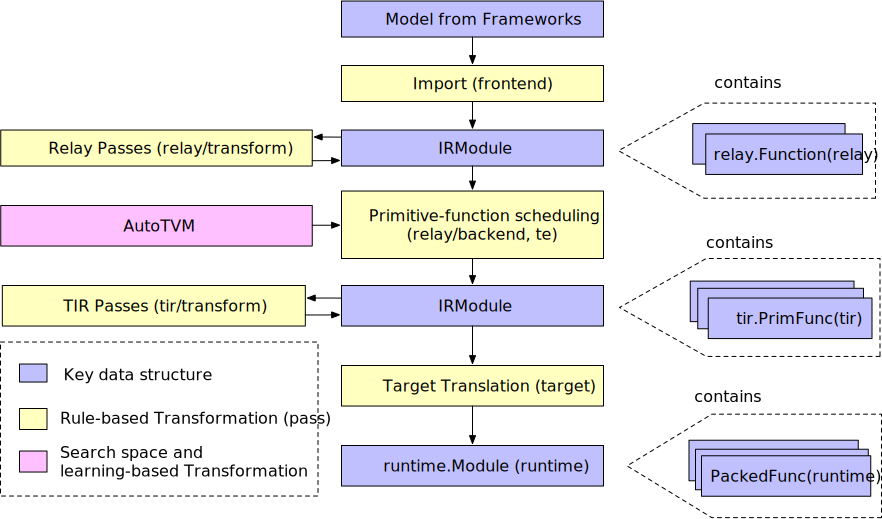
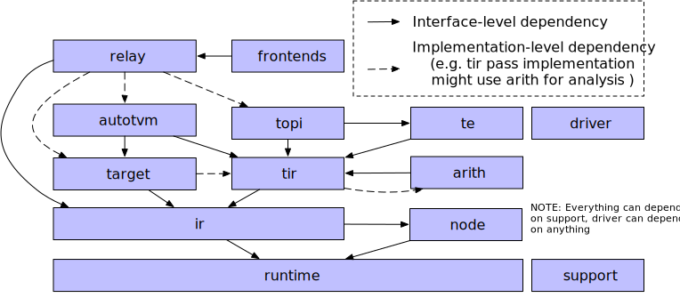

# TVM

[TOC]

## Design And Architecture

主要分为三部分：

- **示例编译流**：TVM将高级描述转换为可部署模块的刘晨合格

- **逻辑架构组件**

- 设备[/目标交互](https://tvm.apache.org/docs/arch/device_target_interactions.html#tvm-target-specific-overview)：每个受支持的物理设备和代码生成目标交互

	

>本指南提供了一些关于架构的补充视图。首先回顾一个端到端的编译流程，并讨论关键的数据结构和转换。这个基于运行时的视图侧重于运行编译器时**每个组件**的交互。然后，我们将回顾代码库的逻辑模块及其关系。本部分提供了设计的静态总体视图。

### 示例编译流程

At a high-level：

- Import：前端组件将模型导入到一个IRModule中，该模块包含了一组内部表示模型的函数。
- Translation：编译器将一个IRModule转换为另一个功能上等价或近似等价（例如在量化的情况下）的IRModule。许多转换与目标（后端）无关。我们也允许目标影响转换流程的配置。
- Target Translation：编译器将IRModule翻译（生成代码）为目标指定的可执行格式。目标翻译的结果被封装为一个runtime.Module，可以导出、加载，并在目标运行环境中执行。
- Runtime Execution：用户加载runtime.Module，并在支持的运行环境中运行编译后的函数。
- 

#### 关键数据结构

​	~设计和理解复杂系统的最佳方法之一是识别关键数据结构和操作（转换）这些数据结构的API。一旦确定了关键数据结构，我们就可以将系统分解成逻辑组件，这些组件要么定义了一组关键数据结构，要么定义了这些数据结构之间的转换。~

​	**IRModule 是整个系统中使用的主要数据结构**。IRModule（中间表示模块）包含了一组函数。目前，我们支持两种主要的函数变体。

1. relay::Function 是高级功能程序表示。一个 relay::Function 通常对应一个**端到端模型**。你可以将 relay::Function 视为一个计算图，并且它支持**控制流、递归和复杂数据结构**。
2. tir::PrimFunc 是低级程序表示，包含了循环嵌套选择、多维度加载/存储、线程和向量/张量指令等元素。它通常用于表示在模型中执行（可能是融合的）层的操作程序。

​	在编译过程中，一个 *relay* 函数可能会被降低到多个 tir::PrimFunc 函数以及一个调用这些 tir::PrimFunc 函数的顶级函数。

#### Transformations

​	每种转换可能有以下目的之一：

- 优化：将程序转换为**等价的、可能更优化**的版本。
- 降级：将程序转换为**更低级的表示**，更接近目标平台。

`	relay/transform` 包含一组优化模型的 passes。优化包括常见的程序优化，如**常量折叠**和死代码消除，以及特定于**张量计算**的 passes，如**布局转换**和**缩放因子折叠**。

​	在 relay 优化管道的末尾，我们会运行一个 pass（FuseOps）**将端到端函数**（例如 MobileNet）**分解为子函数**（例如 conv2d-relu）段。我们称这些为函数段。这一过程帮助我们将原始问题分解为两个子问题：

1. 每个**子函数的编译和优化**。
2. 整体执行结构：我们需要按顺序调用生成的子函数以执行整个模型。

​	我们使用低级的 TIR 阶段来编译和优化每个子函数。☆对于特定目标，我们也可能直接进入目标翻译阶段并使用外部代码生成器。

对于处理整体执行问题，`relay/backend` 中有几种不同的方法。对于具有已知形状且没有控制流的简单模型，我们可以降级到图执行器（graph executor），将执行结构存储在图中。我们也支持动态执行的虚拟机后端。最后，我们计划支持提前编译（AOT），将高级执行结构编译成可执行文件和生成的原始函数。所有这些执行模式都封装在统一的 runtime.Module 接口中，我们将在指南的后面部分讨论。

`tir/transform` 包含 TIR 级函数的转换 passes。许多 tir passes 旨在降级。例如，有将多维访问展平为一维指针访问的 passes，有将内在函数展开为目标特定函数的 passes，还有装饰函数入口以符合运行时调用约定的 passes。当然，也有优化 passes，如访问索引简化和死代码消除。

​	**许多低级优化可以在目标阶段**由 LLVM、CUDA C 和其他目标编译器处理。因此，我们将寄存器分配等低级优化留给下游编译器处理，专注于它们未覆盖的优化。

> 也就是说，关注前中端

#### 搜索空间和基于学习的转换

​	我们之前描述的转换过程是确定性和基于规则的。**TVM 栈的一个设计目标是支持不同硬件平台的高性能代码优化**。为此，我们需要探索尽可能多的优化选择，包括但不限于多维张量访问、循环分块行为、特殊加速器内存层次结构和线程处理。

​	很难定义一种启发式方法来做出所有这些选择。相反，我们**将采用搜索和基于学习的方法**。我们首先定义一组可以用于转换程序的操作。例如操作包括循环转换、内联和向量化。我们称这些操作为==**调度原语**==。这些调度原语的集合定义了我们可以对程序进行的可能优化的搜索空间。系统随后在不同的调度序列中进行搜索，以选择最佳的调度组合。搜索过程通常由机器学习算法指导。

​	一旦搜索完成，我们可以记录一个（可能是融合的）操作符的最佳调度序列。编译器随后可以查找最佳调度序列并将其应用到程序中。值得注意的是，这个调度应用阶段与基于规则的转换完全相同，使我们能够与传统的 passes 共享相同的接口规范。

​	我们使用基于搜索的优化来处理初始 TIR 函数生成问题。模块的这一部分称为 AutoTVM（自动调度器）。我们预计在继续开发 TVM 栈时，将**基于学习的转换扩展到更多领域**。

#### 目标翻译

​	目标翻译阶段将 IRModule 转换为相应的目标可执行格式。对于 x86 和 ARM 等后端，我们使用 LLVM IRBuilder 构建内存中的 LLVM IR。我们还可以生成源级语言，如 CUDA C 和 OpenCL。最后，我们支持通过外部代码生成器直接将 Relay 函数（子图）翻译为特定目标。重要的是，最终的代码生成阶段尽可能轻量化。**绝大多数的转换和降级应该在目标翻译阶段之前完成**。

​	我们还提供了一个 Target 结构来指定编译目标。目标翻译阶段之前的转换也可能受到目标的影响——例如，目标的向量长度会改变向量化行为。

#### Runtime Execution

​	TVM 运行时的主要目标是提供一个最小化的 API，用于在用户选择的语言（包括 Python、C++、Rust、Go、Java 和 JavaScript）中加载和执行编译后的工件。以下代码片段展示了在 Python 中的示例：

```python
import tvm

# 示例运行时执行程序，带有类型注释
mod: tvm.runtime.Module = tvm.runtime.load_module("compiled_artifact.so")
arr: tvm.runtime.NDArray = tvm.nd.array([1, 2, 3], device=tvm.cuda(0))
fun: tvm.runtime.PackedFunc = mod["addone"]
fun(arr)
print(arr.numpy())
```

- `tvm.runtime.Module` 封装了编译结果。`runtime.Module` 包含一个 `GetFunction` 方法，通过名称获取 `PackedFunc`。
- `tvm.runtime.PackedFunc` 是一种类型擦除的函数接口，用于生成的函数。`runtime.PackedFunc` 可以接受和返回以下类型的参数和返回值：POD 类型（int、float）、字符串、runtime.PackedFunc、runtime.Module、runtime.NDArray 以及 runtime.Object 的其他子类。
- `tvm.runtime.Module` 和 `tvm.runtime.PackedFunc` 是模块化运行时的强大机制。例如，为了在 CUDA 上获取上述 `addone` 函数，我们可以使用 LLVM 生成主机端代码来计算启动参数（如线程组的大小），然后调用由 CUDA 驱动 API 支持的 `CUDAModule` 中的另一个 `PackedFunc`。同样的机制也可以用于 OpenCL 内核。

上面的示例仅处理一个简单的 `addone` 函数。下面的代码片段展示了使用相同接口的端到端模型执行示例:

```python
import tvm

# 示例运行时执行程序，带有类型注释
factory: tvm.runtime.Module = tvm.runtime.load_module("resnet18.so")
# 为 resnet18 在 cuda(0) 上创建一个有状态的图执行模块
gmod: tvm.runtime.Module = factory["resnet18"](tvm.cuda(0))
data: tvm.runtime.NDArray = get_input_data()
# 设置输入
gmod["set_input"](0, data)
# 执行模型
gmod["run"]()
# 获取输出
result = gmod .numpy()
```

主要结论是，`runtime.Module` 和 `runtime.PackedFunc` 足以封装操作级别的程序（如 `addone`），以及端到端的模型。

#### 总结和讨论

总结来说，编译流程中的关键数据结构是：

- **IRModule**：包含 `relay.Function` 和 `tir.PrimFunc`
- **runtime.Module**：包含 `runtime.PackedFunc`

编译的大部分过程是这些关键数据结构之间的转换。

- `relay/transform` 和 `tir/transform` 是基于规则的确定性转换
- `auto_scheduler` 和 `autotvm` 包含基于搜索的转换

最后，编译流程示例只是 TVM 栈的一个典型用例。我们将这些关键数据结构和转换暴露给 Python 和 C++ API。因此，您可以像使用 numpy 一样使用 TVM，不同的是，关注的数据结构从 `numpy.ndarray` 变为 `tvm.IRModule`。以下是一些示例用例：

- 使用 Python API 直接构建 IRModule。
- 组合一组自定义的转换（例如，自定义量化）。
- 使用 TVM 的 Python API 直接操作 IR。

## Logical Architecture Components



> 工程的子文件夹以及相互关系
