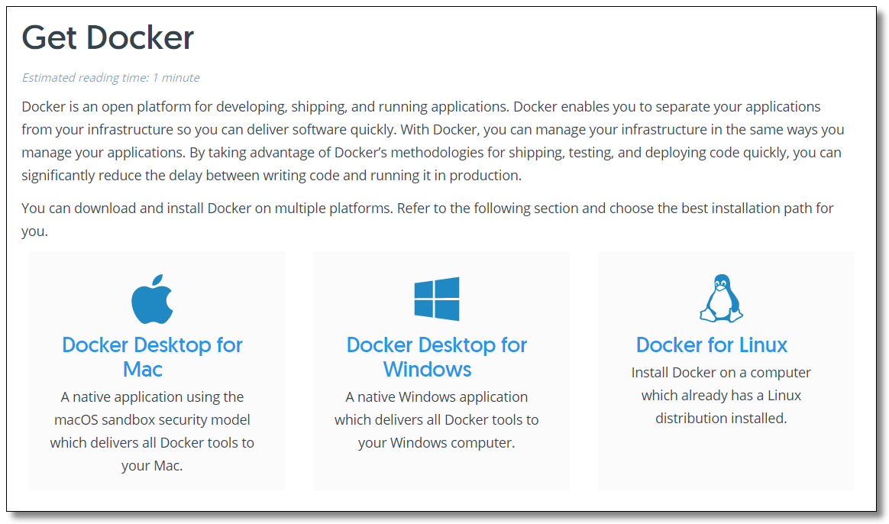

## Docker 版本

　　

　　随着 Docker 的飞速发展，企业级功能的上线，更好的服务意味着需要支付一定的费用，目前 Docker 被分为两个版本：

- community-edition 社区版
- enterprise-edition 企业版

　　Docker 企业版（EE）专为企业开发和 IT 团队设计，可在大规模生产中构建，运送和运行关键业务应用程序。Docker EE 集成，认证和支持，为企业提供业界最安全的容器平台，实现所有应用程序的现代化。作为一个以应用为中心的平台，Docker EE 旨在加速和保护整个软件供应链，从开发到在任何基础设施上运行的生产。

　　我们学习 Docker 使用 CE 社区版即可。


　　

## 在 CentOS 上安装 Docker 引擎

　　



　　

　　Docker 支持 Mac Windows Linux，本文使用 Linux 环境教大家如何基于 CentOS 安装 Docker 及配置镜像加速。

　　官方文档：https://docs.docker.com/

　　

### 系统要求

　　

　　官网提示如果要安装 Docker Engine，您需要一个 CentOS 7 以及以上的稳定版本。

　　

### 卸载旧版本

　　

　　较旧的 Docker 版本为 `docker` 或 `docker-engine`。 如果已安装这些程序，请卸载它们以及相关的依赖项。

```bash
sudo yum remove docker \
                  docker-client \
                  docker-client-latest \
                  docker-common \
                  docker-latest \
                  docker-latest-logrotate \
                  docker-logrotate \
                  docker-engine
```

> Docker 镜像、容器、数据卷和网络数据都保存在 `/var/lib/docker/`。新的 Docker 引擎包现在为 `Docker-ce`。

　　

### 设置 yum 源

　　

　　安装 `yum-utils` 软件包（提供了 `yum-config-manager` 程序）并设置稳定的 yum 源方便下载 Docker Engine。

```bash
# 安装 yum-utils
sudo yum install -y yum-utils
# 设置 yum 源为阿里云方便下载 Docker Engine
sudo yum-config-manager --add-repo http://mirrors.aliyun.com/docker-ce/linux/centos/docker-ce.repo
```

　　

### Docker 安装

　　

　　安装最新版本的 Docker Engine 和容器。

```bash
sudo yum -y install docker-ce docker-ce-cli containerd.io
```


> 安装过程中如果提示您接受 GPG 密钥，请验证指纹是否与 060A 61C5 1B55 8A7F 742B 77AA C52F EB6B 621E 9F35 匹配，如果是，请接受。

　　

### Docker 的启动与停止

　　

```bash
# 启动 docker
sudo systemctl start docker
# 停止 docker
sudo systemctl stop docker
# 重启 docker
sudo systemctl restart docker
# 设置开机启动
sudo systemctl enable docker
# 查看 docker 状态
sudo systemctl status docker
# 查看 docker 内容器的运行状态
sudo docker stats
# 查看 docker 概要信息
sudo docker info
# 查看 docker 帮助文档
sudo docker --help
```

　　

### 安装校验

　　

```bash
[root@localhost ~]# docker -v
Docker version 19.03.12, build 48a66213fe
[root@localhost ~]# docker version
Client: Docker Engine - Community
 Version:           19.03.12
 API version:       1.40
 Go version:        go1.13.10
 Git commit:        48a66213fe
 Built:             Mon Jun 22 15:46:54 2020
 OS/Arch:           linux/amd64
 Experimental:      false

Server: Docker Engine - Community
 Engine:
  Version:          19.03.12
  API version:      1.40 (minimum version 1.12)
  Go version:       go1.13.10
  Git commit:       48a66213fe
  Built:            Mon Jun 22 15:45:28 2020
  OS/Arch:          linux/amd64
  Experimental:     false
 containerd:
  Version:          1.2.13
  GitCommit:        7ad184331fa3e55e52b890ea95e65ba581ae3429
 runc:
  Version:          1.0.0-rc10
  GitCommit:        dc9208a3303feef5b3839f4323d9beb36df0a9dd
 docker-init:
  Version:          0.18.0
  GitCommit:        fec3683
```

　　

## 配置镜像加速

　　

　　Docker 从 Docker Hub 拉取镜像，因为是从国外获取，所以速度较慢，会出现以下情况：

```bash
[root@localhost ~]# docker run hello-world
Unable to find image 'hello-world:latest' locally
docker: Error response from daemon: Get https://registry-1.docker.io/v2/library/hello-world/manifests/latest: net/http: TLS handshake timeout.
See 'docker run --help'.
```

　　

　　可以通过配置国内镜像源的方式，从国内获取镜像，提高拉取速度。这里介绍中国科学技术大学（LUG@USTC）的开源镜像：https://docker.mirrors.ustc.edu.cn 和网易的开源镜像：http://hub-mirror.c.163.com

　　USTC 是老牌的 Linux 镜像服务提供者了，USTC 的 Docker 镜像加速器速度很快。USTC 和网易的优势之一就是不需要注册，属于真正的公共服务。（也可以使用阿里等其他服务商的镜像加速服务）


　　

　　编辑文件 `daemon.json `。

```bash
vi /etc/docker/daemon.json
```

　　

　　在文件中输入以下内容并保存。

```json
{
  "registry-mirrors": ["http://hub-mirror.c.163.com", "https://docker.mirrors.ustc.edu.cn"]
}
```

　　

　　重新加载配置信息及重启 Docker 服务。

```bash
# 重新加载某个服务的配置文件
sudo systemctl daemon-reload
# 重新启动 docker
sudo systemctl restart docker

```

　　

## hello-world

　　

　　通过运行 `hello-world` 镜像来验证 `Docker Engine` 是否已正确安装。

```bash
[root@localhost ~]# docker run hello-world
Unable to find image 'hello-world:latest' locally # 本地找不到 hello-world 镜像
latest: Pulling from library/hello-world # 拉取最新版本的 hello-world 镜像
0e03bdcc26d7: Pull complete 
Digest: sha256:49a1c8800c94df04e9658809b006fd8a686cab8028d33cfba2cc049724254202
Status: Downloaded newer image for hello-world:latest

# 看到此消息表示您已正常安装。
Hello from Docker!
This message shows that your installation appears to be working correctly.

To generate this message, Docker took the following steps:
 1. The Docker client contacted the Docker daemon.
 2. The Docker daemon pulled the "hello-world" image from the Docker Hub.
    (amd64)
 3. The Docker daemon created a new container from that image which runs the
    executable that produces the output you are currently reading.
 4. The Docker daemon streamed that output to the Docker client, which sent it
    to your terminal.

To try something more ambitious, you can run an Ubuntu container with:
 $ docker run -it ubuntu bash

Share images, automate workflows, and more with a free Docker ID:
 https://hub.docker.com/

For more examples and ideas, visit:
 https://docs.docker.com/get-started/

```

　　

　　`docker run hello-world` 命令执行流程图如下。


　　通过以上步骤大家已完成 Docker 安装的所有工作，接下来就可以通过学习镜像命令和容器命令更加熟悉 Docker 的使用。

