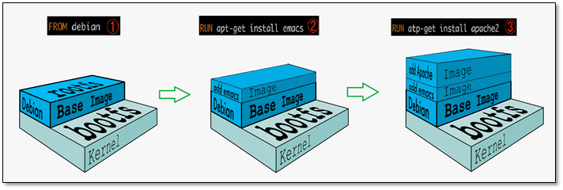
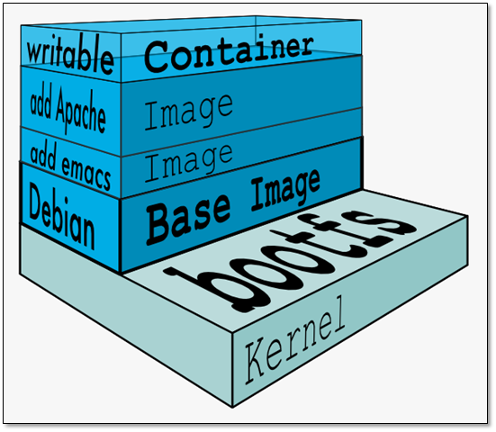
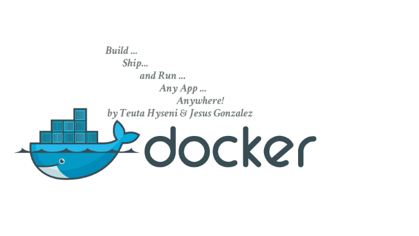

　　通过下图可以得知，`Docker` 在运行时分为 `Docker 引擎（服务端守护进程）` 和 `客户端工具`，我们日常使用各种 `docker 命令`，其实就是在使用 `客户端工具` 与 `Docker 引擎` 进行交互。

## Client 客户端

　　

　　Docker 是一个客户端-服务器（C/S）架构程序。Docker 客户端只需要向 Docker 服务器或者守护进程发出请求，服务器或者守护进程将完成所有工作并返回结果。Docker 提供了一个命令行工具 Docker 以及一整套 RESTful API。你可以在同一台宿主机上运行 Docker 守护进程和客户端，也可以从本地的 Docker 客户端连接到运行在另一台宿主机上的远程 Docker 守护进程。

　　

## Host 主机(Docker 引擎)

　　

　　一个物理或者虚拟的机器用于执行 Docker 守护进程和容器。

　　

## Image 镜像

　　

　　什么是 Docker 镜像？简单的理解，Docker 镜像就是一个 Linux 的文件系统（Root FileSystem），这个文件系统里面包含可以运行在 Linux 内核的程序以及相应的数据。

　　通过镜像启动一个容器，一个镜像就是一个可执行的包，其中包括运行应用程序所需要的所有内容：包含代码，运行时间，库，环境变量和配置文件等。

　　Docker 把 App 文件打包成为一个镜像，并且采用类似多次快照的存储技术，可以实现：

- 多个 App 可以共用相同的底层镜像（初始的操作系统镜像）；
- App 运行时的 IO 操作和镜像文件隔离；
- 通过挂载包含不同配置/数据文件的目录或者卷（Volume），单个 App 镜像可以用来运行无数个不同业务的容器。

　　

## Container 容器

　　

　　镜像（Image）和容器（Container）的关系，就像是面向对象程序设计中的类和实例一样，镜像是静态的定义，容器是镜像运行时的实体。容器可以被创建、启动、停止、删除、暂停等。

| Docker | 面向对象 |
| :----- | :------- |
| 镜像   | 类       |
| 容器   | 对象     |

　　

## 镜像分层

　　

　　Docker 支持通过扩展现有镜像，创建新的镜像。实际上，Docker Hub 中 99% 的镜像都是通过在 base 镜像中安装和配置需要的软件构建出来的。

　　

　　

　　从上图可以看到，新镜像是从 base 镜像一层一层叠加生成的。每安装一个软件，就在现有镜像的基础上增加一层。

　　镜像分层最大的一个好处就是共享资源。比如说有多个镜像都从相同的 base 镜像构建而来，那么 Docker Host 只需在磁盘上保存一份 base 镜像；同时内存中也只需加载一份 base 镜像，就可以为所有容器服务了。而且镜像的每一层都可以被共享。

　　如果多个容器共享一份基础镜像，当某个容器修改了基础镜像的内容，比如 /etc 下的文件，这时其他容器的 /etc 是不会被修改的，修改只会被限制在单个容器内。这就是容器 **Copy-on-Write** 特性。

　　

### 可写的容器层

　　

　　当容器启动时，一个新的可写层被加载到镜像的顶部。这一层通常被称作“容器层”，“容器层”之下的都叫“镜像层”。

　　

　　

　　所有对容器的改动 - 无论添加、删除、还是修改文件都只会发生在容器层中。只有**容器层是可写的，容器层下面的所有镜像层都是只读的**。

　　镜像层数量可能会很多，所有镜像层会联合在一起组成一个统一的文件系统。如果不同层中有一个相同路径的文件，比如 /a，上层的 /a 会覆盖下层的 /a，也就是说用户只能访问到上层中的文件 /a。在容器层中，用户看到的是一个叠加之后的文件系统。

| 文件操作 | 说明                                                         |
| -------- | ------------------------------------------------------------ |
| 添加文件 | 在容器中创建文件时，新文件被添加到容器层中。                 |
| 读取文件 | 在容器中读取某个文件时，Docker 会从上往下依次在各镜像层中查找此文件。一旦找到，立即将其复制到容器层，然后打开并读入内存。 |
| 修改文件 | 在容器中修改已存在的文件时，Docker 会从上往下依次在各镜像层中查找此文件。一旦找到，立即将其复制到容器层，然后修改之。 |
| 删除文件 | 在容器中删除文件时，Docker 也是从上往下依次在镜像层中查找此文件。找到后，会在容器层中**记录下此删除操作**。（只是记录删除操作） |

　　只有当需要修改时才复制一份数据，这种特性被称作 Copy-on-Write。可见，容器层保存的是镜像变化的部分，不会对镜像本身进行任何修改。

> 总结下来就是：容器层记录对镜像的修改，所有镜像层都是只读的，不会被容器修改，所以镜像可以被多个容器共享。

　　

## Volume 数据卷

　　

　　实际上我们的容器就好像是一个简易版的操作系统，只不过系统中只安装了我们的程序运行所需要的环境，前边说到我们的容器是可以删除的，那如果删除了，容器中的程序产生的需要持久化的数据怎么办呢？容器运行的时候我们可以进容器去查看，容器一旦删除就什么都没有了。

　　所以数据卷就是来解决这个问题的，是用来将数据持久化到我们宿主机上，与容器间实现数据共享，简单的说就是将宿主机的目录映射到容器中的目录，应用程序在容器中的目录读写数据会同步到宿主机上，这样容器产生的数据就可以持久化了，比如我们的数据库容器，就可以把数据存储到我们宿主机上的真实磁盘中。

　　

## Registry 注册中心

　　

　　Docker 用 Registry 来保存用户构建的镜像。Registry 分为公共和私有两种。Docker 公司运营公共的 Registry 叫做 Docker Hub。用户可以在 Docker Hub 注册账号，分享并保存自己的镜像。

　　Docker 公司提供了公共的镜像仓库 [https://hub.docker.com](https://hub.docker.com/)（Docker 称之为 Repository）提供了庞大的镜像集合供使用。

　　一个 Docker Registry 中可以包含多个仓库（Repository）；每个仓库可以包含多个标签（Tag）；每个标签对应一个镜像。

　　通常，一个仓库会包含同一个软件不同版本的镜像，而标签对应该软件的各个版本。我们可以通过 **<仓库名>:<标签>** 的格式来指定具体是这个软件哪个版本的镜像。如果不给出标签，将以 **latest** 作为默认标签。

　　

## 总结

　　Docker 官网写着这样一句话：**Build and Ship any Application Anywhere**，再接合刚才我们所理解的内容，总结下来就是：**一次构建，到处运行。**

　　此外，Docker 公司提供了公共的镜像仓库 [https://hub.docker.com](https://hub.docker.com/)（Docker 称之为 Repository），GitHub connect，自动构建镜像，大大简化了应用分发、部署、升级流程。加上 Docker 可以非常方便的建立各种自定义的镜像文件，这些都是 Docker 成为最流行的容器技术的重要因素。

> 　　通过以上这些技术的组合，最后的结果就是：绝大部分应用，开发者都可以通过 docker build 创建镜像，通过 docker push 上传镜像，用户通过 docker pull 下载镜像，使用 docker run 运行容器应用。用户不再需要去关心如何搭建环境，如何安装，如何解决不同发行版的库冲突——而且通常不会消耗更多的硬件资源，不会明显降低性能。

