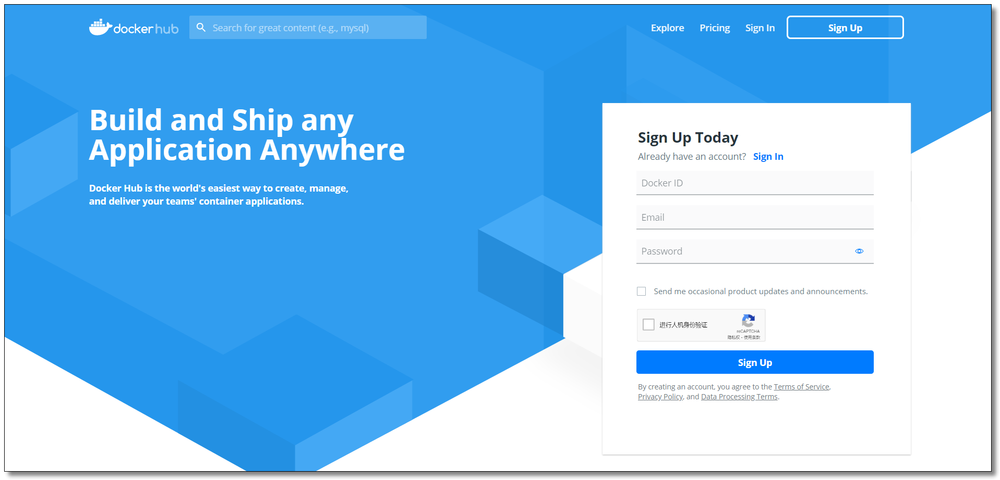
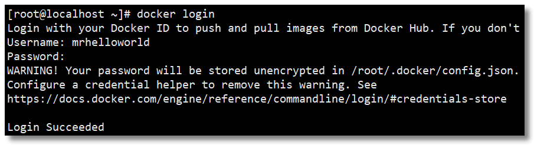
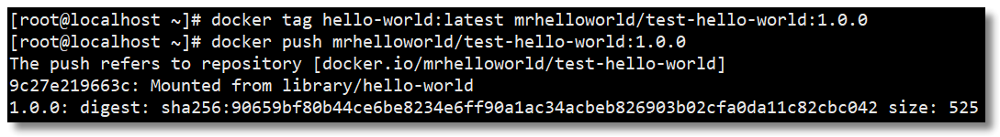
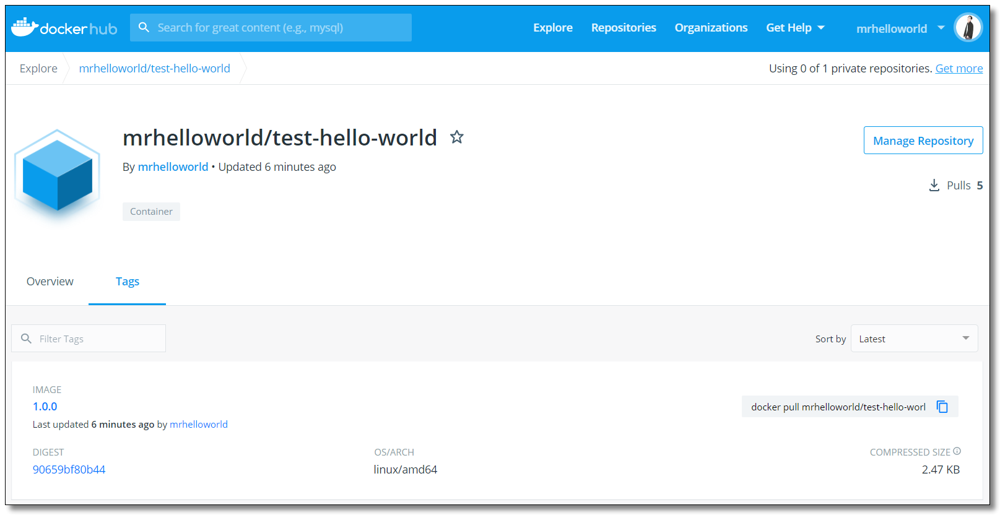
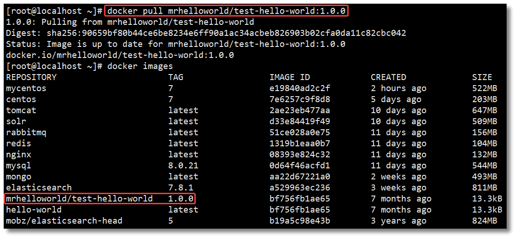

　　之前我们使用的镜像都是从 DockerHub 公共仓库拉取的，我们也学习了如何制作自己的镜像，但是通过 tar 包的方式实现镜像的备份恢复迁移对于团队协作开发并不是特别友好，我们也可以将镜像推送至 DockerHub 仓库方便使用。

　　温馨提示：如果构建的镜像内携带了项目数据，建议还是使用私有仓库比较好。

　　

## 注册账号

　　

　　官网：https://hub.docker.com/



　　

## 登录账号

　　

　　通过 `docker login` 命令输入账号密码登录 DockerHub。



　　

## 推送镜像至仓库

　　

　　为了方便测试，我们将 `hello-world` 镜像拉取至本地，然后再上传至 DockerHub 仓库中。

　　先给镜像设置标签 `docker tag local-image:tagname new-repo:tagname`；

　　再将镜像推送至仓库 `docker push new-repo:tagname`。

```shell
docker tag hello-world:latest xxxx/test-hello-world:1.0.0
docker push xxxx/test-hello-world:1.0.0
```



　　

## 查看仓库

　　



　　

## 拉取镜像

　　

　　通过 `docker pull xxxx/test-hello-world:1.0.0` 测试镜像是否可以拉取。



　　

## 退出账号

　　

　　通过 `docker logout` 命令退出 DockerHub。

```shell
[root@localhost ~]# docker logout
Removing login credentials for https://index.docker.io/v1/
```


　　DockerHub 镜像仓库的使用就学到这里，考虑到网络的原因，从 DockerHub 下载和上传镜像速度可能会比较慢；在生产上使用的 Docker 镜像可能包含我们的代码、配置信息等，不想被外部人员获取，只允许内网的开发人员下载。怎么解决呢？可以通过搭建私有镜像仓库实现，下文我们就一起学习如何搭建 Docker 私有镜像仓库。

