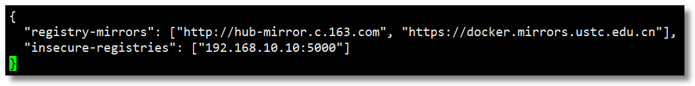
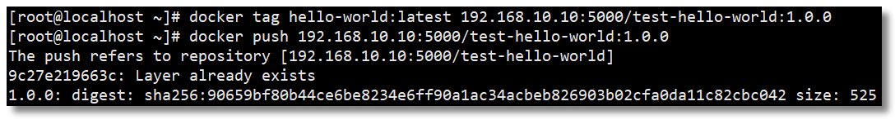
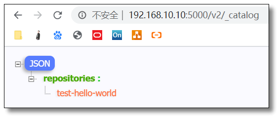
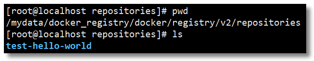
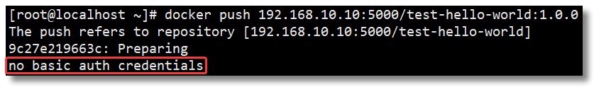
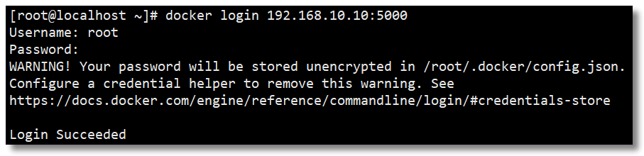
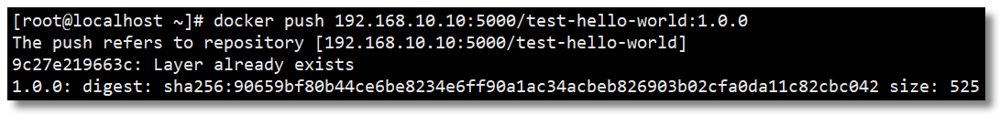

　　DockerHub 为我们提供了很多官方镜像和个人上传的镜像，我们可以下载机构或个人提供的镜像，也可以上传我们自己的本地镜像，但缺点是：

- 由于网络的原因，从 DockerHub 下载和上传镜像速度可能会比较慢；
- 在生产上使用的 Docker 镜像可能包含我们的代码、配置信息等，不想被外部人员获取，只允许内网的开发人员下载。

　　

　　为了解决以上问题，Docker 官方提供了一个叫做 `registry` 的镜像用于搭建本地私有仓库使用。在内部网络搭建的 Docker 私有仓库可以使内网人员下载、上传都非常快速，不受外网带宽等因素的影响，同时不在内网的人员也无法下载我们的镜像，并且私有仓库也支持配置仓库认证功能。接下来详细讲解 `registry` 私有仓库的搭建过程。

　　

## 拉取私有仓库镜像

　　

　　拉取私有仓库镜像。

```shell
docker pull registry
```

　　

## 修改配置

　　

　　修改 daemon.json 文件。

```shell
vi /etc/docker/daemon.json
```

　　添加以下内容，用于让 Docker 信任私有仓库地址，保存退出。

```json
{
    "insecure-registries": ["192.168.10.10:5000"]
}
```



　　重新加载配置信息及重启 Docker 服务。

```bash
# 重新加载某个服务的配置文件
sudo systemctl daemon-reload
# 重新启动 docker
sudo systemctl restart docker
```

　　

## 创建私有仓库容器

　　

　　创建私有仓库容器。

```shell
docker run -di --name registry -p 5000:5000 -v /mydata/docker_registry:/var/lib/registry registry
```

- `-d`：后台运行容器；
- `--name`：为创建的容器命名；
- `-p`：表示端口映射，前者是宿主机端口，后者是容器内的映射端口。可以使用多个 -p 做多个端口映射；
- `-v`：将容器内 `/var/lib/registry` 目录下的数据挂载至宿主机 `/mydata/docker_registry` 目录下；

　　

　　打开浏览器输入：http://192.168.10.10:5000/v2/_catalog 看到 `{"repositories":[]}` 表示私有仓库搭建成功并且内容为空。

　　

## 推送镜像至私有仓库

　　

　　先给镜像设置标签 `docker tag local-image:tagname new-repo:tagname`；

　　再将镜像推送至私有仓库 `docker push new-repo:tagname`。

```shell
docker tag hello-world:latest 192.168.10.10:5000/test-hello-world:1.0.0
docker push 192.168.10.10:5000/test-hello-world:1.0.0
```



　　

　　打开浏览器输入：http://192.168.10.10:5000/v2/_catalog 可以看到私有仓库中已上传的镜像。



　　由于我们做了目录挂载，因此可以在宿主机 `/mydata/docker_registry/docker/registry/v2/repositories` 目录下查看。



　　

## 配置私有仓库认证

　　

　　私有仓库已经搭建好了，要确保私有仓库的安全性，还需要一个安全认证证书，防止发生意想不到的事情。所以需要在搭建私有仓库的 Docker 主机上先生成自签名证书。

　　

　　创建证书存储目录。

```shell
mkdir -p /usr/local/registry/certs
```

　　生成自签名证书命令。

```shell
openssl req -newkey rsa:2048 -nodes -sha256 -keyout /usr/local/registry/certs/domain.key -x509 -days 365 -out /usr/local/registry/certs/domain.crt
```

- `openssl req`：创建证书签名请求等功能；
- `-newkey`：创建 CSR 证书签名文件和 RSA 私钥文件；
- `rsa:2048`：指定创建的 RSA 私钥长度为 2048；
- `-nodes`：对私钥不进行加密；
- `-sha256`：使用 SHA256 算法；
- `-keyout`：创建的私钥文件名称及位置；
- `-x509`：自签发证书格式；
- `-days`：证书有效期；
- `-out`：指定 CSR 输出文件名称及位置；

　　

### 生成自签名证书

　　

　　通过 openssl 先生成自签名证书，运行命令以后需要填写一些证书信息，里面最关键的部分是：`Common Name (eg, your name or your server's hostname) []:192.168.10.10`，这里填写的是私有仓库的地址。

```shell
[root@localhost ~]# openssl req -newkey rsa:2048 -nodes -sha256 -keyout /usr/local/registry/certs/domain.key -x509 -days 365 -out /usr/local/registry/certs/domain.crt
Generating a 2048 bit RSA private key
.......................+++
.........................+++
writing new private key to '/usr/local/registry/certs/domain.key'
-----
You are about to be asked to enter information that will be incorporated
into your certificate request.
What you are about to enter is what is called a Distinguished Name or a DN.
There are quite a few fields but you can leave some blank
For some fields there will be a default value,
If you enter '.', the field will be left blank.
-----
Country Name (2 letter code) [XX]:CN
State or Province Name (full name) []:SH
Locality Name (eg, city) [Default City]:SH
Organization Name (eg, company) [Default Company Ltd]:mrhelloworld
Organizational Unit Name (eg, section) []:mrhelloworld
Common Name (eg, your name or your server's hostname) []:192.168.10.10
Email Address []:mrhelloworld@126.com

```

　　

### 生成鉴权密码文件

　　

```shell
# 创建存储鉴权密码文件目录
mkdir -p /usr/local/registry/auth
# 如果没有 htpasswd 功能需要安装 httpd
yum install -y httpd
# 创建用户和密码
htpasswd -Bbn root 1234 > /usr/local/registry/auth/htpasswd

```

> htpasswd 是 apache http 的基本认证文件，使用 htpasswd 命令可以生成用户及密码文件。

　　

### 创建私有仓库容器

　　

```shell
docker run -di --name registry -p 5000:5000 \
   -v /mydata/docker_registry:/var/lib/registry \
   -v /usr/local/registry/certs:/certs \
   -v /usr/local/registry/auth:/auth \
   -e "REGISTRY_AUTH=htpasswd" \
   -e "REGISTRY_AUTH_HTPASSWD_REALM=Registry Realm" \
   -e REGISTRY_AUTH_HTPASSWD_PATH=/auth/htpasswd \
   -e REGISTRY_HTTP_TLS_CERTIFICATE=/certs/domain.crt \
   -e REGISTRY_HTTP_TLS_KEY=/certs/domain.key \
   registry

```

　　

### 推送镜像至私有仓库失败

　　

　　先给镜像设置标签 `docker tag local-image:tagname new-repo:tagname`；

　　再将镜像推送至私有仓库 `docker push new-repo:tagname`。

```shell
docker tag hello-world:latest 192.168.10.10:5000/test-hello-world:1.0.0
docker push 192.168.10.10:5000/test-hello-world:1.0.0

```

　　如果直接 push 镜像肯定会失败，并且出现 `no basic auth credentials` 的错误，这是因为我们没有进行登录认证。



　　

### 登录账号

　　

　　通过 `docker login` 命令输入账号密码登录私有仓库。



　　

### 推送镜像至私有仓库成功

　　

　　再次 push 镜像，发现已经可以推送成功了。



　　

### 退出账号

　　

　　通过 `docker logout` 命令退出账号。

```shell
[root@localhost ~]# docker logout 192.168.10.10:5000
Removing login credentials for 192.168.10.10:5000

```


　　私有镜像仓库的搭建还可以通过 Harbor 实现，Harbor 是由 VMware 公司开源的企业级的 Docker Registry 管理项目，它包括权限管理(RBAC)、LDAP、日志审核、管理界面、自我注册、镜像复制和中文支持等功能。后期我也会和大家分享关于 Harbor 的使用，下文我们先来学习 Docker 网络相关的内容，解决一下容器网络通信的问题。

