　　当项目大规模使用 Docker 时，容器通信的问题也就产生了。要解决容器通信问题，必须先了解很多关于网络的知识。Docker 作为目前最火的轻量级容器技术，有很多令人称道的功能，如 Docker 的镜像管理。然而，Docker 同样有着很多不完善的地方，网络方面就是 Docker 比较薄弱的部分。因此，我们有必要深入了解 Docker 的网络知识，以满足更高的网络需求。

　　

## 默认网络

　　

　　安装 Docker 以后，会默认创建三种网络，可以通过 `docker network ls` 查看。

```shell
[root@localhost ~]# docker network ls
NETWORK ID          NAME                DRIVER              SCOPE
688d1970f72e        bridge              bridge              local
885da101da7d        host                host                local
f4f1b3cf1b7f        none                null                local
```

　　

　　在学习 Docker 网络之前，我们有必要先来了解一下这几种网络模式都是什么意思。

| 网络模式  | 简介                                                         |
| --------- | ------------------------------------------------------------ |
| bridge    | 为每一个容器分配、设置 IP 等，并将容器连接到一个 `docker0` 虚拟网桥，默认为该模式。 |
| host      | 容器将不会虚拟出自己的网卡，配置自己的 IP 等，而是使用宿主机的 IP 和端口。 |
| none      | 容器有独立的 Network namespace，但并没有对其进行任何网络设置，如分配 veth pair 和网桥连接，IP 等。 |
| container | 新创建的容器不会创建自己的网卡和配置自己的 IP，而是和一个指定的容器共享 IP、端口范围等。 |

　　

### bridge 网络模式

　　

　　在该模式中，Docker 守护进程创建了一个虚拟以太网桥 `docker0`，新建的容器会自动桥接到这个接口，附加在其上的任何网卡之间都能自动转发数据包。

　　默认情况下，守护进程会创建一对对等虚拟设备接口 `veth pair`，将其中一个接口设置为容器的 `eth0` 接口（容器的网卡），另一个接口放置在宿主机的命名空间中，以类似 `vethxxx` 这样的名字命名，从而将宿主机上的所有容器都连接到这个内部网络上。

　　比如我运行一个基于 `busybox` 镜像构建的容器 `bbox01`，查看 `ip addr`：

> busybox 被称为嵌入式 Linux 的瑞士军刀，整合了很多小的 unix 下的通用功能到一个小的可执行文件中。

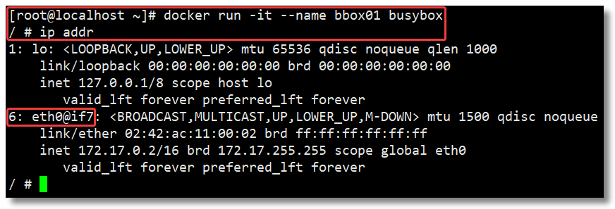

　　然后宿主机通过 `ip addr` 查看信息如下：

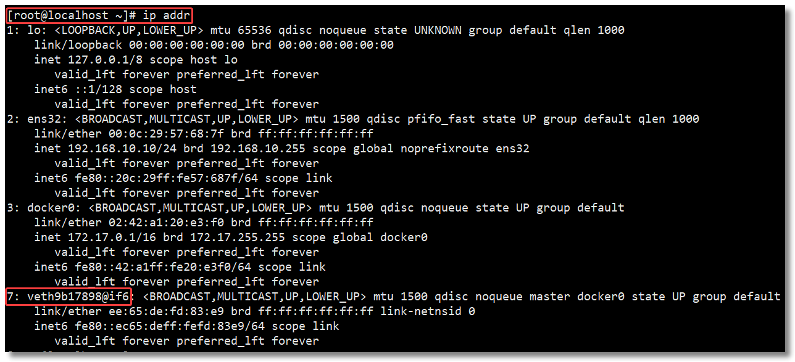

　　通过以上的比较可以发现，证实了之前所说的：守护进程会创建一对对等虚拟设备接口 `veth pair`，将其中一个接口设置为容器的 `eth0` 接口（容器的网卡），另一个接口放置在宿主机的命名空间中，以类似 `vethxxx` 这样的名字命名。

　　同时，守护进程还会从网桥 `docker0` 的私有地址空间中分配一个 IP 地址和子网给该容器，并设置 docker0 的 IP 地址为容器的默认网关。也可以安装 `yum install -y bridge-utils` 以后，通过 `brctl show` 命令查看网桥信息。

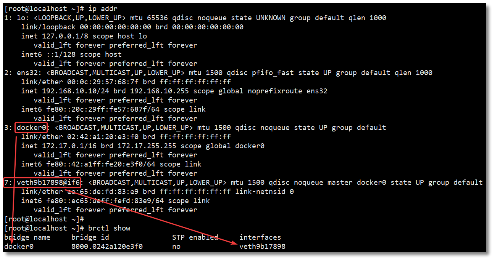

　　对于每个容器的 IP 地址和 Gateway 信息，我们可以通过 `docker inspect 容器名称|ID` 进行查看，在 `NetworkSettings` 节点中可以看到详细信息。

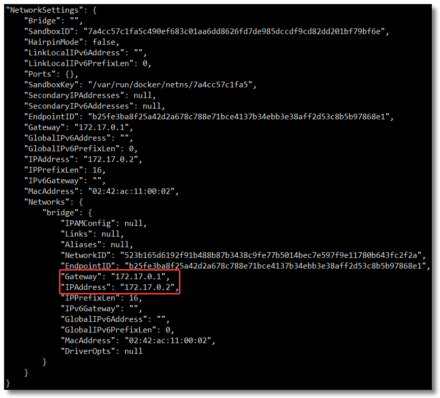

　　我们可以通过 `docker network inspect bridge` 查看所有 `bridge` 网络模式下的容器，在 `Containers` 节点中可以看到容器名称。

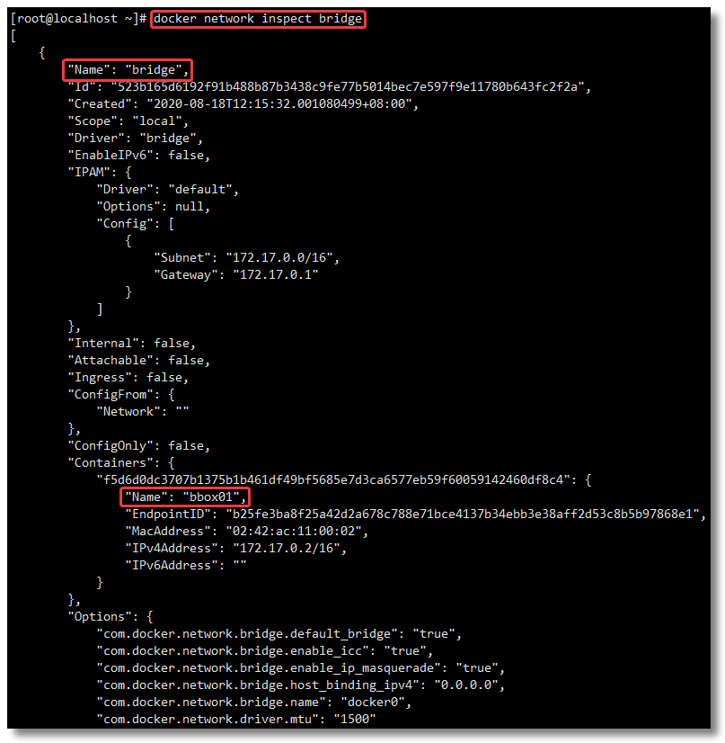

> 　　关于 `bridge` 网络模式的使用，只需要在创建容器时通过参数 `--net bridge` 或者 `--network bridge` 指定即可，当然这也是创建容器默认使用的网络模式，也就是说这个参数是可以省略的。

　　

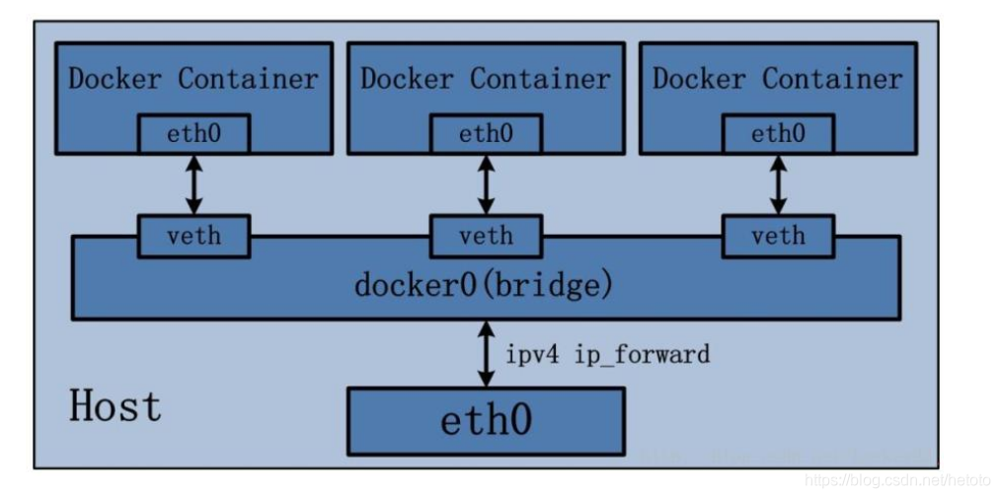

Bridge 桥接模式的实现步骤主要如下：

- Docker Daemon 利用 veth pair 技术，在宿主机上创建一对对等虚拟网络接口设备，假设为 veth0 和 veth1。而
  veth pair 技术的特性可以保证无论哪一个 veth 接收到网络报文，都会将报文传输给另一方。
- Docker Daemon 将 veth0 附加到 Docker Daemon 创建的 docker0 网桥上。保证宿主机的网络报文可以发往 veth0；
- Docker Daemon 将 veth1 添加到 Docker Container 所属的 namespace 下，并被改名为 eth0。如此一来，宿主机的网络报文若发往 veth0，则立即会被 Container 的 eth0 接收，实现宿主机到 Docker Container 网络的联通性；同时，也保证 Docker Container 单独使用 eth0，实现容器网络环境的隔离性。

　　

### host 网络模式

　　

- host 网络模式需要在创建容器时通过参数 `--net host` 或者 `--network host` 指定；
- 采用 host 网络模式的 Docker Container，可以直接使用宿主机的 IP 地址与外界进行通信，若宿主机的 eth0 是一个公有 IP，那么容器也拥有这个公有 IP。同时容器内服务的端口也可以使用宿主机的端口，无需额外进行 NAT 转换；
- host 网络模式可以让容器共享宿主机网络栈，这样的好处是外部主机与容器直接通信，但是容器的网络缺少隔离性。

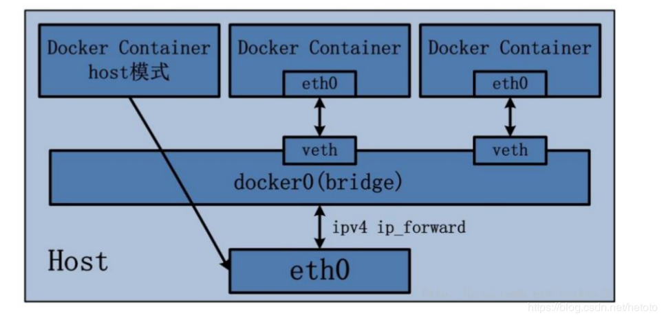

　　

　　比如我基于 `host` 网络模式创建了一个基于 `busybox` 镜像构建的容器 `bbox02`，查看 `ip addr`：

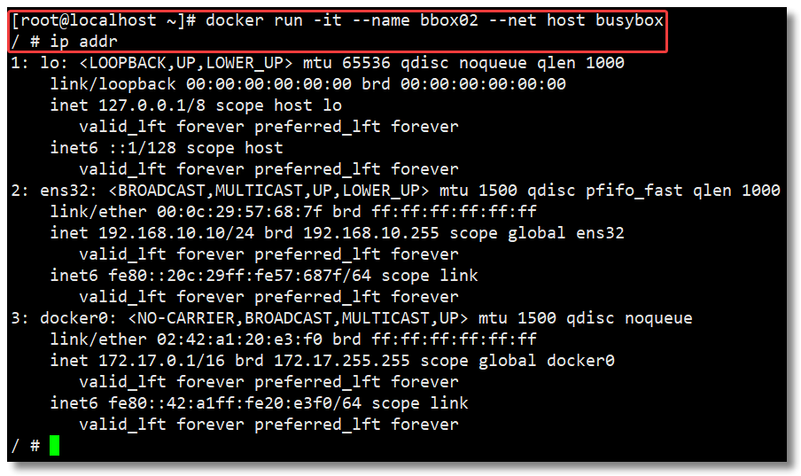

　　然后宿主机通过 `ip addr` 查看信息如下：

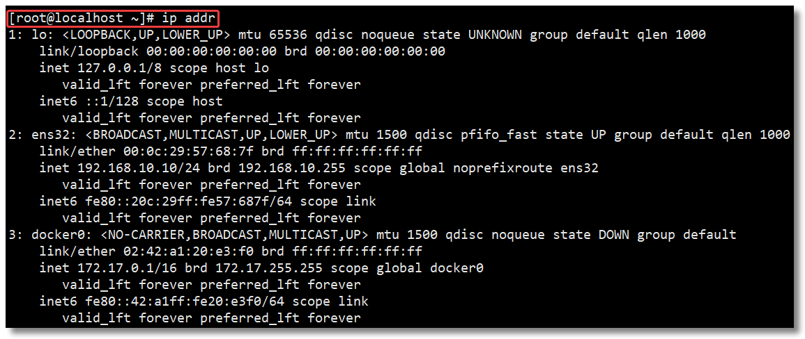

　　对，你没有看错，返回信息一模一样，我也可以肯定我没有截错图，不信接着往下看。我们可以通过 `docker network inspect host` 查看所有 `host` 网络模式下的容器，在 `Containers` 节点中可以看到容器名称。

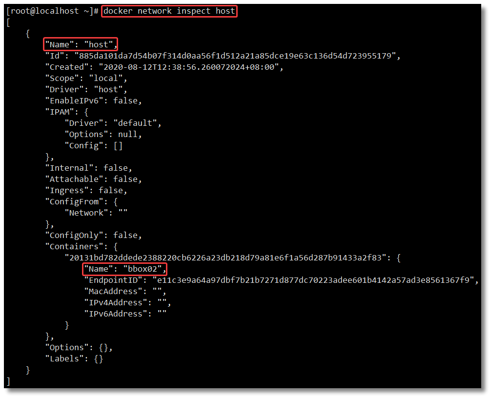

　　

### none 网络模式

　　

- none 网络模式是指禁用网络功能，只有 lo 接口 local 的简写，代表 127.0.0.1，即 localhost 本地环回接口。在创建容器时通过参数 `--net none` 或者 `--network none` 指定；
- none 网络模式即不为 Docker Container 创建任何的网络环境，容器内部就只能使用 loopback 网络设备，不会再有其他的网络资源。可以说 none 模式为 Docke Container 做了极少的网络设定，但是俗话说得好“少即是多”，在没有网络配置的情况下，作为 Docker 开发者，才能在这基础做其他无限多可能的网络定制开发。这也恰巧体现了 Docker 设计理念的开放。

　　

　　比如我基于 `none` 网络模式创建了一个基于 `busybox` 镜像构建的容器 `bbox03`，查看 `ip addr`：

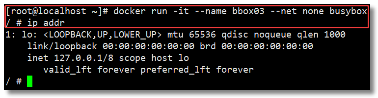

　　我们可以通过 `docker network inspect none` 查看所有 `none` 网络模式下的容器，在 `Containers` 节点中可以看到容器名称。

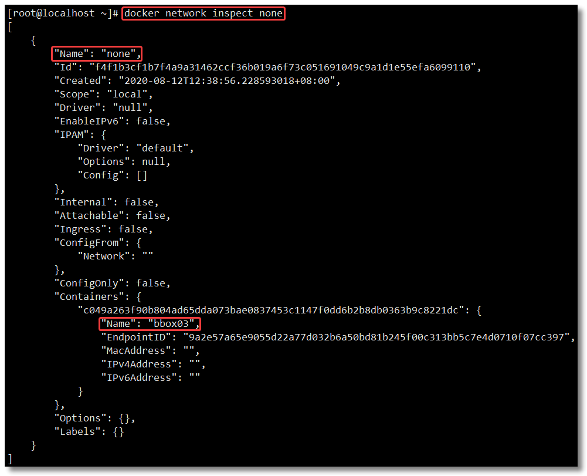

　　

### container 网络模式

　　

- Container 网络模式是 Docker 中一种较为特别的网络的模式。在创建容器时通过参数 `--net container:已运行的容器名称|ID` 或者 `--network container:已运行的容器名称|ID` 指定；
- 处于这个模式下的 Docker 容器会共享一个网络栈，这样两个容器之间可以使用 localhost 高效快速通信。

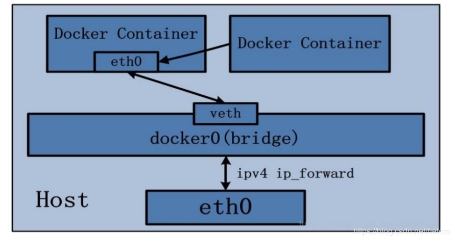

　　**Container 网络模式即新创建的容器不会创建自己的网卡，配置自己的 IP，而是和一个指定的容器共享 IP、端口范围等**。同样两个容器除了网络方面相同之外，其他的如文件系统、进程列表等还是隔离的。

　　

　　比如我基于容器 `bbox01` 创建了 `container` 网络模式的容器 `bbox04`，查看 `ip addr`：

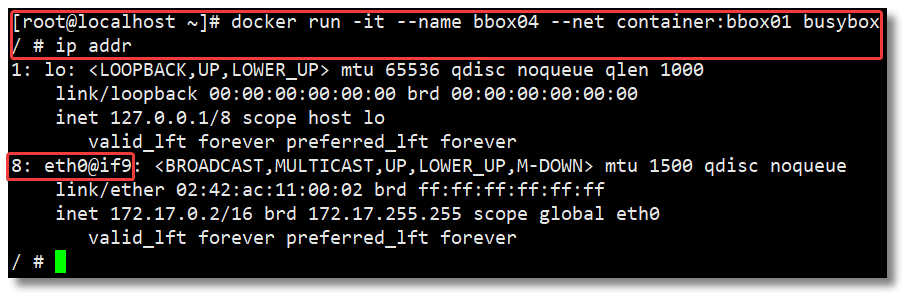

　　容器 `bbox01` 的 `ip addr` 信息如下：

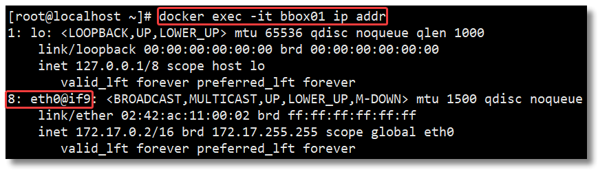

　　宿主机的 `ip addr` 信息如下：

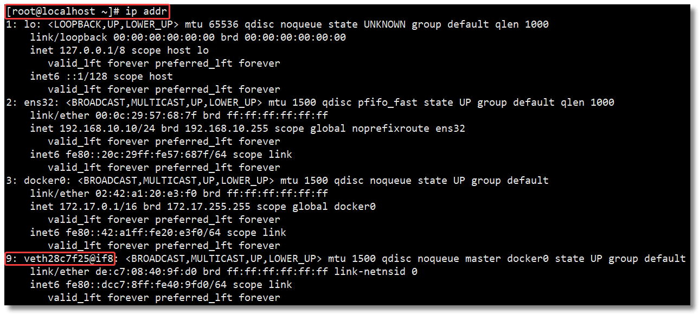

　　通过以上测试可以发现，Docker 守护进程只创建了一对对等虚拟设备接口用于连接 bbox01 容器和宿主机，而 bbox04 容器则直接使用了 bbox01 容器的网卡信息。

　　这个时候如果将 bbox01 容器停止，会发现 bbox04 容器就只剩下 lo 接口了。

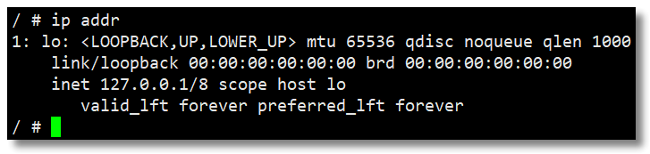

　　然后 bbox01 容器重启以后，bbox04 容器也重启一下，就又可以获取到网卡信息了。

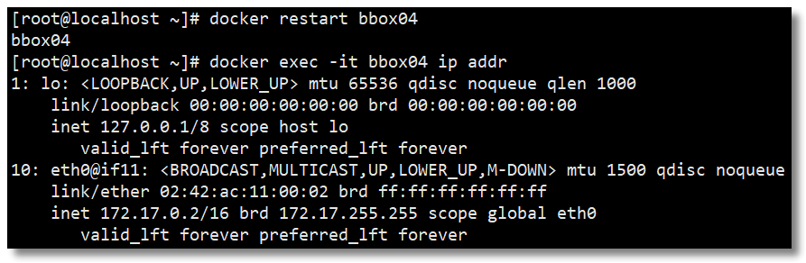

　　

### ~~link~~

　　

　　`docker run --link` 可以用来连接两个容器，使得源容器（被链接的容器）和接收容器（主动去链接的容器）之间可以互相通信，并且接收容器可以获取源容器的一些数据，如源容器的环境变量。

　　这种方式**官方已不推荐使用**，并且在未来版本可能会被移除，所以这里不作为重点讲解，感兴趣可自行了解。 

　　官网警告信息：https://docs.docker.com/network/links/

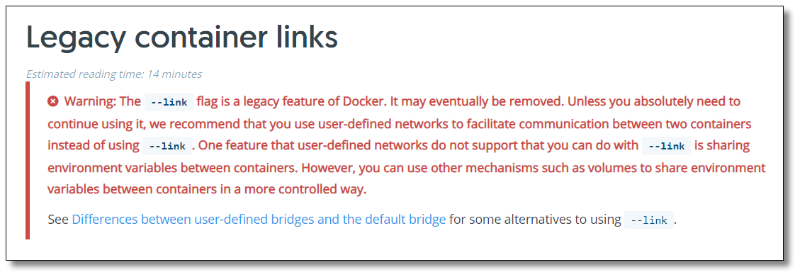

　　

## 自定义网络

　　

　　虽然 Docker 提供的默认网络使用比较简单，但是为了保证各容器中应用的安全性，在实际开发中更推荐使用自定义的网络进行容器管理，以及启用容器名称到 IP 地址的自动 DNS 解析。

> 　　从 Docker 1.10 版本开始，docker daemon 实现了一个内嵌的 DNS server，使容器可以直接通过容器名称进行通信。方法很简单，只要在创建容器时使用 `--name` 为容器命名即可。
>
> 　　但是使用 Docker DNS 有个限制：**只能在 user-defined 网络中使用**。也就是说，默认的 bridge 网络是无法使用 DNS 的，所以我们就需要自定义网络。

　　

### 创建网络

　　

　　通过 `docker network create` 命令可以创建自定义网络模式，命令提示如下：

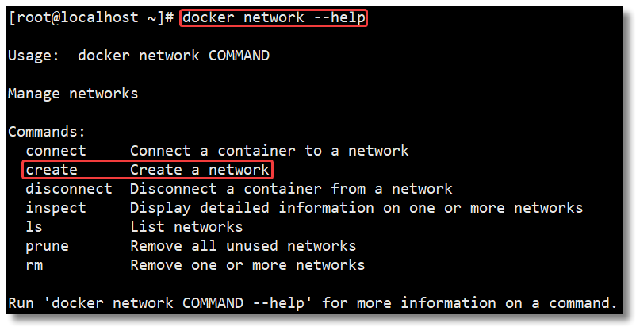

　　

　　进一步查看 `docker network create` 命令使用详情，发现可以通过 `--driver` 指定网络模式且默认是 `bridge` 网络模式，提示如下：

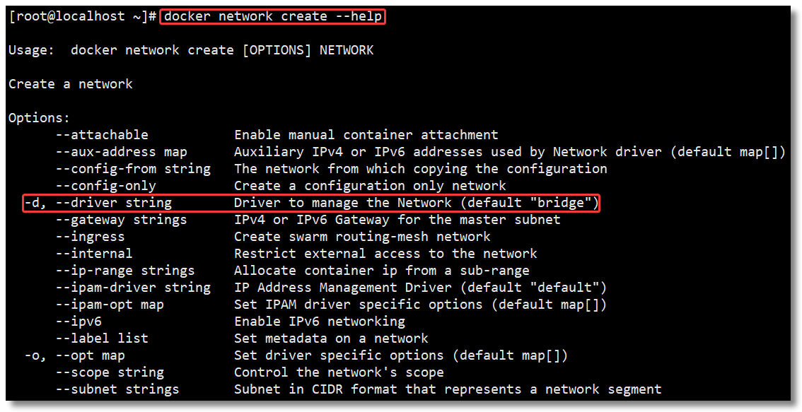

　　

　　创建一个基于 `bridge` 网络模式的自定义网络模式 `custom_network`，完整命令如下：

```shell
docker network create custom_network
```

　　

　　通过 `docker network ls` 查看网络模式：

```shell
[root@localhost ~]# docker network ls
NETWORK ID          NAME                DRIVER              SCOPE
b3634bbd8943        bridge              bridge              local
062082493d3a        custom_network      bridge              local
885da101da7d        host                host                local
f4f1b3cf1b7f        none                null                local
```

　　

　　通过自定义网络模式 `custom_network` 创建容器：

```shell
docker run -di --name bbox05 --net custom_network busybox
```

　　

　　通过 `docker inspect 容器名称|ID` 查看容器的网络信息，在 `NetworkSettings` 节点中可以看到详细信息。

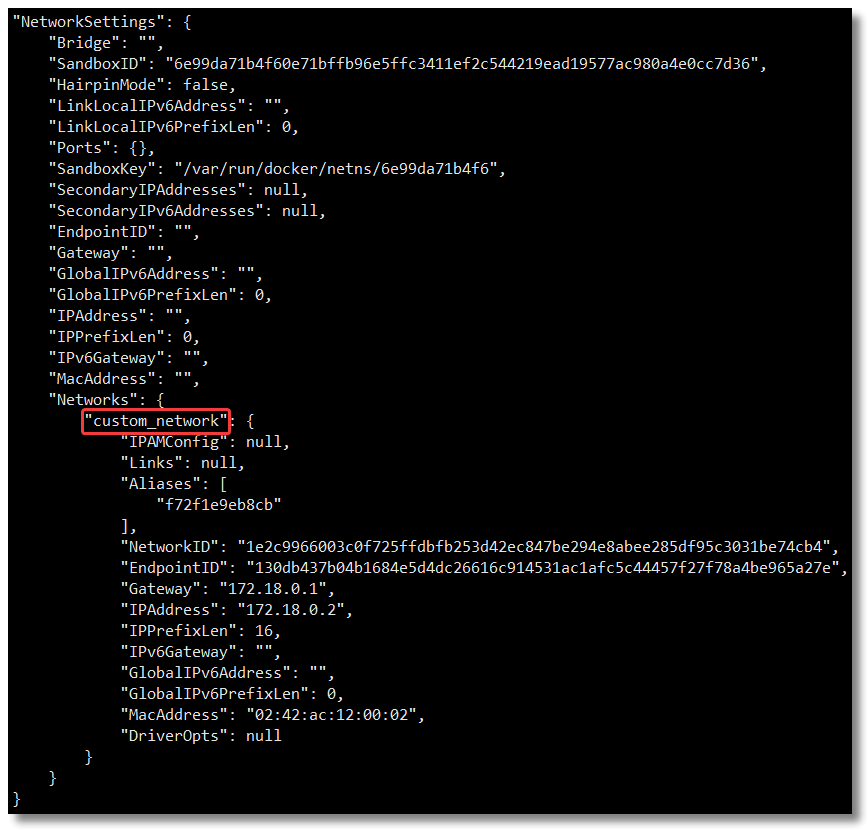

　　

### 连接网络

　　

　　通过 `docker network connect 网络名称 容器名称` 为容器连接新的网络模式。

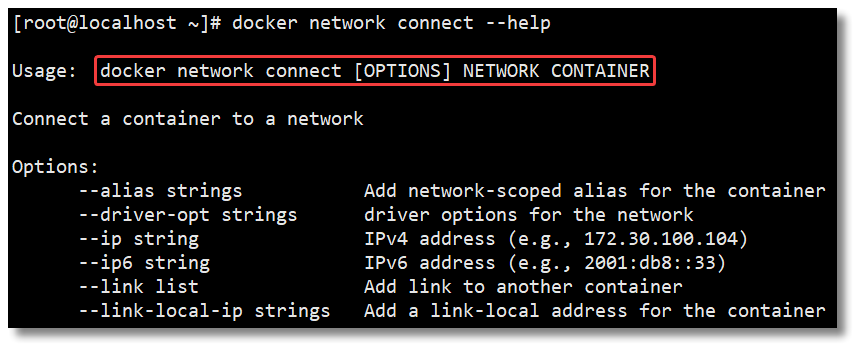

```shell
docker network connect bridge bbox05
```

　　通过 `docker inspect 容器名称|ID` 再次查看容器的网络信息，多增加了默认的 `bridge`。

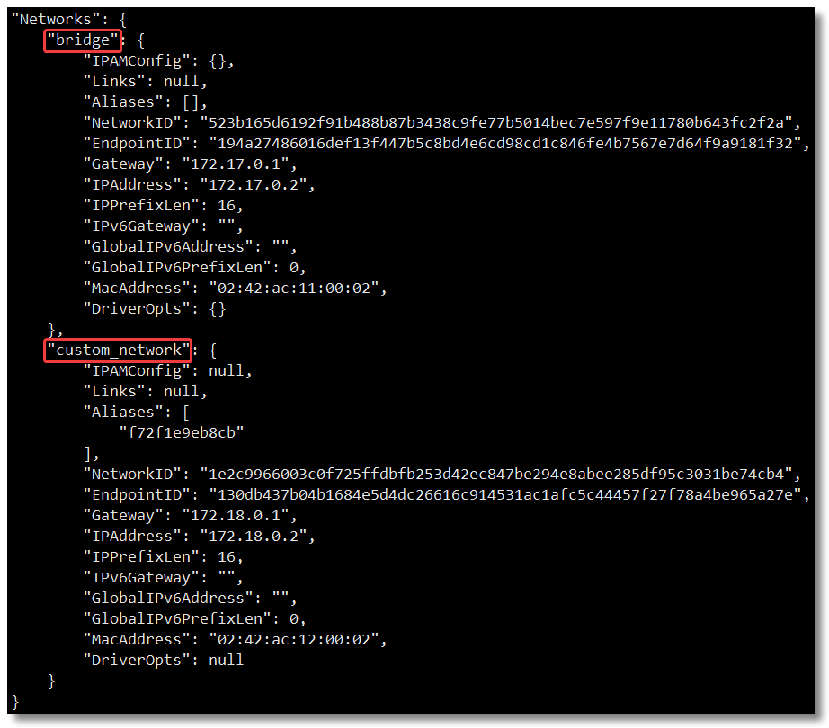

　　

### 断开网络

　　

　　通过 `docker network disconnect 网络名称 容器名称` 命令断开网络。

```shell
docker network disconnect custom_network bbox05
```

　　通过 `docker inspect 容器名称|ID` 再次查看容器的网络信息，发现只剩下默认的 `bridge`。

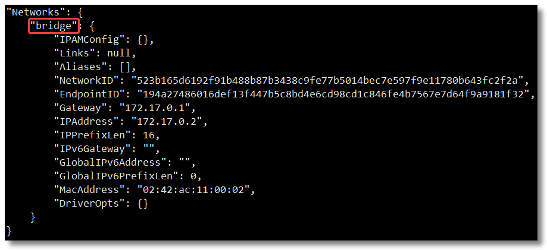

　　

### 移除网络

　　

　　可以通过 `docker network rm 网络名称` 命令移除自定义网络模式，网络模式移除成功会返回网络模式名称。

```shell
docker network rm custom_network
```

> 注意：如果通过某个自定义网络模式创建了容器，则该网络模式无法删除。

　　

## 容器间网络通信

　　

　　接下来我们通过所学的知识实现容器间的网络通信。首先明确一点，容器之间要互相通信，必须要有属于同一个网络的网卡。

　　我们先创建两个基于默认的 `bridge` 网络模式的容器。

```shell
docker run -di --name default_bbox01 busybox
docker run -di --name default_bbox02 busybox
```

　　

　　通过 `docker network inspect bridge` 查看两容器的具体 IP 信息。

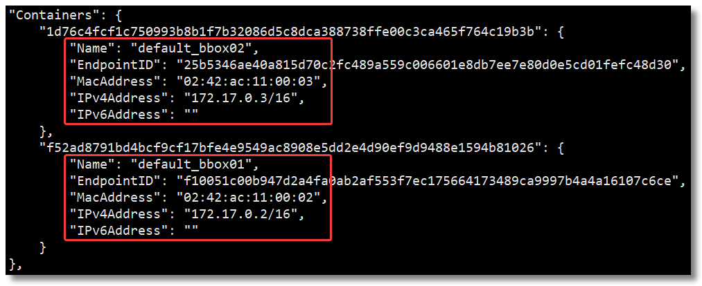

　　

　　然后测试两容器间是否可以进行网络通信。

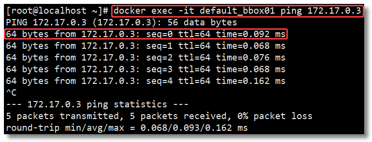

　　

　　经过测试，从结果得知两个属于同一个网络的容器是可以进行网络通信的，但是 IP 地址可能是不固定的，有被更改的情况发生，那容器内所有通信的 IP 地址也需要进行更改，能否使用容器名称进行网络通信？继续测试。

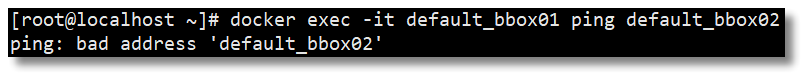

　　

　　经过测试，从结果得知使用容器进行网络通信是不行的，那怎么实现这个功能呢？

　　从 Docker 1.10 版本开始，docker daemon 实现了一个内嵌的 DNS server，使容器可以直接通过容器名称通信。方法很简单，只要在创建容器时使用 `--name` 为容器命名即可。

　　但是使用 Docker DNS 有个限制：**只能在 user-defined 网络中使用**。也就是说，默认的 bridge 网络是无法使用 DNS 的，所以我们就需要自定义网络。

　　我们先基于 `bridge` 网络模式创建自定义网络 `custom_network`，然后创建两个基于自定义网络模式的容器。

```shell
docker run -di --name custom_bbox01 --net custom_network busybox
docker run -di --name custom_bbox02 --net custom_network busybox

```

　　

　　通过 `docker network inspect custom_network` 查看两容器的具体 IP 信息。

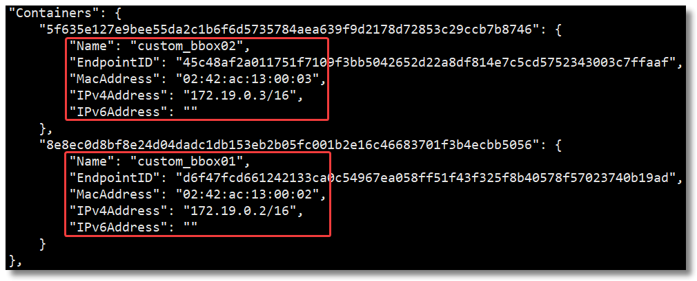

　　

　　然后测试两容器间是否可以进行网络通信，分别使用具体 IP 和容器名称进行网络通信。

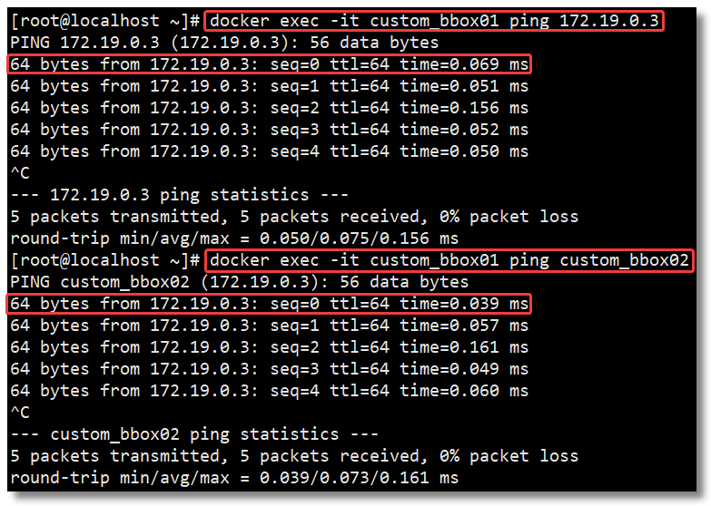

　　

　　经过测试，从结果得知两个属于同一个自定义网络的容器是可以进行网络通信的，并且可以使用容器名称进行网络通信。

　　那如果此时我希望 `bridge` 网络下的容器可以和 `custom_network` 网络下的容器进行网络又该如何操作？其实答案也非常简单：让 `bridge` 网络下的容器连接至新的 `custom_network` 网络即可。

```shell
docker network connect custom_network default_bbox01

```

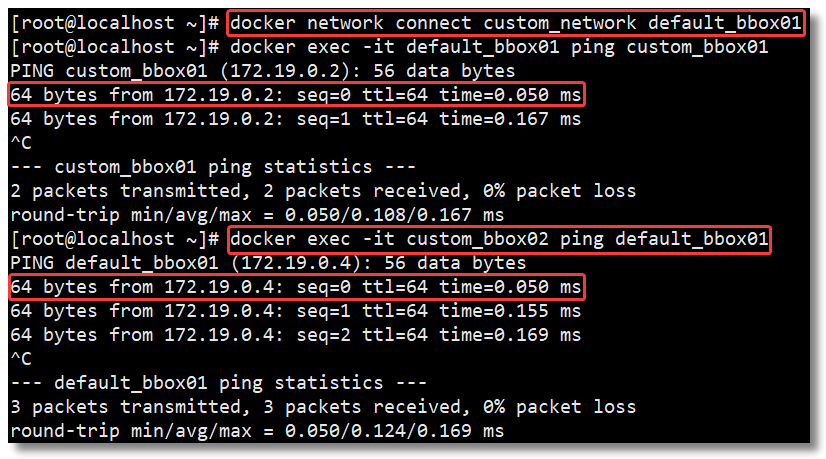

　　学完容器网络通信，大家就可以练习使用多个容器完成常见应用集群的部署了。后面就该学习 Docker 进阶部分的内容 Docker Compose 和 Docker Swarm。

