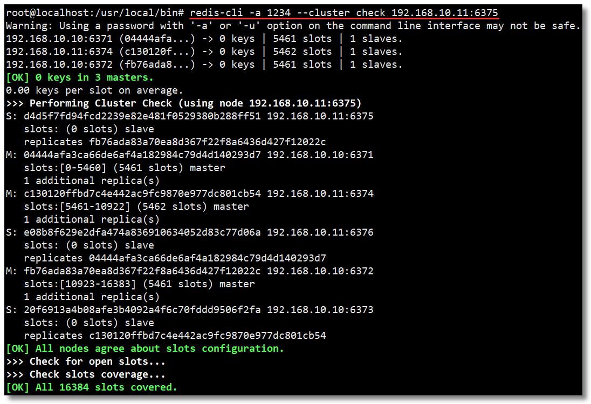
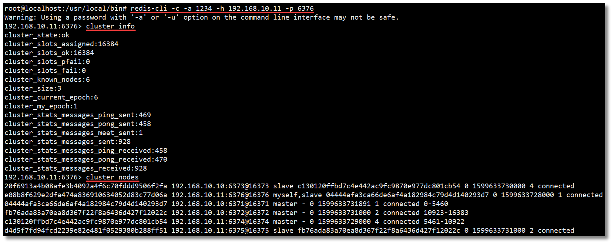
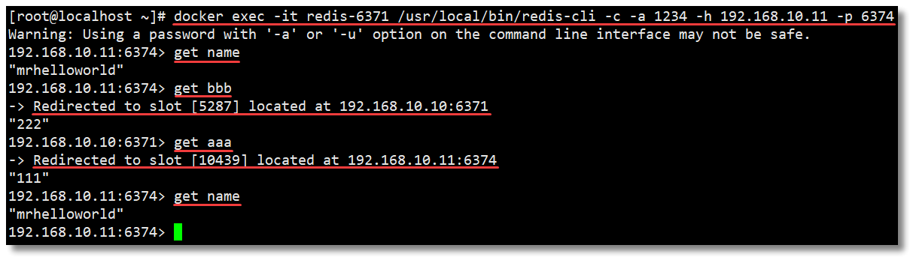

　　在前文《Docker 搭建 Redis Cluster 集群环境》中我已经教过大家如何搭建了，本文使用 Docker Compose 再带大家搭建一遍，其目的主要是为了让大家感受 Docker Compose 所带来的便捷之处。

　　按照 Redis 官网：https://redis.io/topics/cluster-tutorial 的提示，为了使 Docker 与 Redis Cluster 兼容，您需要使用 Docker 的 `host` 网络模式。

　　`host` 网络模式需要在创建容器时通过参数 `--net host` 或者 `--network host` 指定，`host` 网络模式可以让**容器共享宿主机网络栈**，容器将不会虚拟出自己的网卡，配置自己的 IP 等，而是使用宿主机的 IP 和端口。

　　关于 Docker 网络模式更多的内容请阅读《Docker 网络模式详解及容器间网络通信》。


　　

## 环境

　　

　　为了让环境更加真实，本文使用**多机**环境：

- `192.168.10.10`
- `192.168.10.11`

　　

　　每台机器所使用的基础设施环境如下：

- `CentOS 7.8.2003`
- `Docker version 19.03.12  `


　　

## 搭建

　　

　　整体搭建步骤主要分为以下几步：

- 下载 Redis 镜像（其实这步可以省略，因为创建容器时，如果本地镜像不存在，就会去远程拉取）；
- 编写 Redis 配置文件；
- 编写 Docker Compose 模板文件；
- 创建并启动所有服务容器；
- 创建 Redis Cluster 集群。

　　

### 编写 Redis 配置文件

　　

#### 创建目录及文件

　　

　　分别在 `192.168.10.10` 和 `192.168.10.11` 两台机器上执行以下操作。

```shell
# 创建目录
mkdir -p /usr/local/docker-redis/redis-cluster
# 切换至指定目录
cd /usr/local/docker-redis/redis-cluster/
# 编写 redis-cluster.tmpl 文件
vi redis-cluster.tmpl
```

　　

#### 编写配置文件

　　

　　`192.168.10.10` 机器的 `redis-cluster.tmpl` 文件内容如下：

```tmpl
port ${PORT}
requirepass 1234
masterauth 1234
protected-mode no
daemonize no
appendonly yes
cluster-enabled yes
cluster-config-file nodes.conf
cluster-node-timeout 15000
cluster-announce-ip 192.168.10.10
cluster-announce-port ${PORT}
cluster-announce-bus-port 1${PORT}
```

　　`192.168.10.11` 机器的 `redis-cluster.tmpl` 文件内容如下：

```tmpl
port ${PORT}
requirepass 1234
masterauth 1234
protected-mode no
daemonize no
appendonly yes
cluster-enabled yes
cluster-config-file nodes.conf
cluster-node-timeout 15000
cluster-announce-ip 192.168.10.11
cluster-announce-port ${PORT}
cluster-announce-bus-port 1${PORT}
```

- `port`：节点端口；
- `requirepass`：添加访问认证；
- `masterauth`：如果主节点开启了访问认证，从节点访问主节点需要认证；
- `protected-mode`：保护模式，默认值 yes，即开启。开启保护模式以后，需配置 `bind ip` 或者设置访问密码；关闭保护模式，外部网络可以直接访问；
- `daemonize`：是否以守护线程的方式启动（后台启动），默认 no；
- `appendonly`：是否开启 AOF 持久化模式，默认 no；
- `cluster-enabled`：是否开启集群模式，默认 no；
- `cluster-config-file`：集群节点信息文件；
- `cluster-node-timeout`：集群节点连接超时时间；
- `cluster-announce-ip`：集群节点 IP，填写宿主机的 IP；
- `cluster-announce-port`：集群节点映射端口；
- `cluster-announce-bus-port`：集群节点总线端口。

> 　　每个 Redis 集群节点都需要打开**两个 TCP 连接**。一个用于为客户端提供服务的正常 Redis TCP 端口，例如 6379。还有一个基于 6379 端口加 10000 的端口，比如 16379。
>
> 　　第二个端口用于集群总线，这是一个使用二进制协议的节点到节点通信通道。节点使用集群总线进行故障检测、配置更新、故障转移授权等等。客户端永远不要尝试与集群总线端口通信，与正常的 Redis 命令端口通信即可，但是请确保防火墙中的这两个端口都已经打开，否则 Redis 集群节点将无法通信。

　　

　　在 `192.168.10.10` 机器的 `redis-cluster` 目录下执行以下命令：

```shell
for port in `seq 6371 6373`; do \
  mkdir -p ${port}/conf \
  && PORT=${port} envsubst < redis-cluster.tmpl > ${port}/conf/redis.conf \
  && mkdir -p ${port}/data;\
done
```

　　在 `192.168.10.11` 机器的 `redis-cluster` 目录下执行以下命令：

```shell
for port in `seq 6374 6376`; do \
  mkdir -p ${port}/conf \
  && PORT=${port} envsubst < redis-cluster.tmpl > ${port}/conf/redis.conf \
  && mkdir -p ${port}/data;\
done
```

> 上面两段 shell for 语句，意思就是循环创建 6371 ~ 6376 相关的目录及文件。

　　

　　在 `192.168.10.10` 机器执行查看命令结果如下，如果没有 `tree` 命令先安装 `yum install -y tree`。


　　在 `192.168.10.11` 机器执行查看命令结果如下。


　　

　　以下内容为每个节点的配置文件详细信息。

```shell
============================== 192.168.10.10 ==============================
[root@localhost redis-cluster]# cat /usr/local/docker-redis/redis-cluster/637{1..3}/conf/redis.conf
port 6371
requirepass 1234
masterauth 1234
protected-mode no
daemonize no
appendonly yes
cluster-enabled yes
cluster-config-file nodes.conf
cluster-node-timeout 15000
cluster-announce-ip 192.168.10.10
cluster-announce-port 6371
cluster-announce-bus-port 16371

port 6372
requirepass 1234
masterauth 1234
protected-mode no
daemonize no
appendonly yes
cluster-enabled yes
cluster-config-file nodes.conf
cluster-node-timeout 15000
cluster-announce-ip 192.168.10.10
cluster-announce-port 6372
cluster-announce-bus-port 16372

port 6373
requirepass 1234
masterauth 1234
protected-mode no
daemonize no
appendonly yes
cluster-enabled yes
cluster-config-file nodes.conf
cluster-node-timeout 15000
cluster-announce-ip 192.168.10.10
cluster-announce-port 6373
cluster-announce-bus-port 16373
============================== 192.168.10.10 ==============================

============================== 192.168.10.11 ==============================
[root@localhost redis-cluster]# cat /usr/local/docker-redis/redis-cluster/637{4..6}/conf/redis.conf
port 6374
requirepass 1234
masterauth 1234
protected-mode no
daemonize no
appendonly yes
cluster-enabled yes
cluster-config-file nodes.conf
cluster-node-timeout 15000
cluster-announce-ip 192.168.10.11
cluster-announce-port 6374
cluster-announce-bus-port 16374

port 6375
requirepass 1234
masterauth 1234
protected-mode no
daemonize no
appendonly yes
cluster-enabled yes
cluster-config-file nodes.conf
cluster-node-timeout 15000
cluster-announce-ip 192.168.10.11
cluster-announce-port 6375
cluster-announce-bus-port 16375

port 6376
requirepass 1234
masterauth 1234
protected-mode no
daemonize no
appendonly yes
cluster-enabled yes
cluster-config-file nodes.conf
cluster-node-timeout 15000
cluster-announce-ip 192.168.10.11
cluster-announce-port 6376
cluster-announce-bus-port 16376
============================== 192.168.10.11 ==============================
```

　　

### 编写 Docker Compose 模板文件

　　

　　在 `192.168.10.10` 机器的 `/usr/local/docker-redis` 目录下创建 `docker-compose.yml` 文件并编辑。

```yaml
# 描述 Compose 文件的版本信息
version: "3.8"

# 定义服务，可以多个
services:
  redis-6371: # 服务名称
    image: redis # 创建容器时所需的镜像
    container_name: redis-6371 # 容器名称
    restart: always # 容器总是重新启动
    network_mode: "host" # host 网络模式
    volumes: # 数据卷，目录挂载
      - /usr/local/docker-redis/redis-cluster/6371/conf/redis.conf:/usr/local/etc/redis/redis.conf
      - /usr/local/docker-redis/redis-cluster/6371/data:/data
    command: redis-server /usr/local/etc/redis/redis.conf # 覆盖容器启动后默认执行的命令

  redis-6372:
    image: redis
    container_name: redis-6372
    network_mode: "host"
    volumes:
      - /usr/local/docker-redis/redis-cluster/6372/conf/redis.conf:/usr/local/etc/redis/redis.conf
      - /usr/local/docker-redis/redis-cluster/6372/data:/data
    command: redis-server /usr/local/etc/redis/redis.conf

  redis-6373:
    image: redis
    container_name: redis-6373
    network_mode: "host"
    volumes:
      - /usr/local/docker-redis/redis-cluster/6373/conf/redis.conf:/usr/local/etc/redis/redis.conf
      - /usr/local/docker-redis/redis-cluster/6373/data:/data
    command: redis-server /usr/local/etc/redis/redis.conf
```

　　

　　在 `192.168.10.11` 机器的 `/usr/local/docker-redis` 目录下创建 `docker-compose.yml` 文件并编辑。

```yaml
# 描述 Compose 文件的版本信息
version: "3.8"

# 定义服务，可以多个
services:
  redis-6374: # 服务名称
    image: redis # 创建容器时所需的镜像
    container_name: redis-6374 # 容器名称
    restart: always # 容器总是重新启动
    network_mode: "host" # host 网络模式
    volumes: # 数据卷，目录挂载
      - /usr/local/docker-redis/redis-cluster/6374/conf/redis.conf:/usr/local/etc/redis/redis.conf
      - /usr/local/docker-redis/redis-cluster/6374/data:/data
    command: redis-server /usr/local/etc/redis/redis.conf # 覆盖容器启动后默认执行的命令

  redis-6375:
    image: redis
    container_name: redis-6375
    network_mode: "host"
    volumes:
      - /usr/local/docker-redis/redis-cluster/6375/conf/redis.conf:/usr/local/etc/redis/redis.conf
      - /usr/local/docker-redis/redis-cluster/6375/data:/data
    command: redis-server /usr/local/etc/redis/redis.conf

  redis-6376:
    image: redis
    container_name: redis-6376
    network_mode: "host"
    volumes:
      - /usr/local/docker-redis/redis-cluster/6376/conf/redis.conf:/usr/local/etc/redis/redis.conf
      - /usr/local/docker-redis/redis-cluster/6376/data:/data
    command: redis-server /usr/local/etc/redis/redis.conf
```

　　

### 创建并启动所有服务容器

　　

　　分别在 `192.168.10.10` 和 `192.168.10.11` 机器的 `/usr/local/docker-redis` 目录下执行以下命令：

```shell
docker-compose up -d

```


　　

### 创建 Redis Cluster 集群

　　

　　请先确保你的两台机器可以互相通信，然后随便进入一个容器节点，并进入 `/usr/local/bin/` 目录：

```shell
# 进入容器
docker exec -it redis-6371 bash
# 切换至指定目录
cd /usr/local/bin/

```

　　

　　接下来我们就可以通过以下命令实现 Redis Cluster 集群的创建。

```shell
redis-cli -a 1234 --cluster create 192.168.10.10:6371 192.168.10.10:6372 192.168.10.10:6373 192.168.10.11:6374 192.168.10.11:6375 192.168.10.11:6376 --cluster-replicas 1

```

　　

　　出现选择提示信息，输入 **yes**，结果如下所示：


　　集群创建成功如下：


　　

　　以下内容是创建集群时返回的详细信息，也就是上两幅图中的所有内容。

```shell
root@localhost:/usr/local/bin# redis-cli -a 1234 --cluster create 192.168.10.10:6371 192.168.10.10:6372 192.168.10.10:6373 192.168.10.11:6374 192.168.10.11:6375 192.168.10.11:6376 --cluster-replicas 1
Warning: Using a password with '-a' or '-u' option on the command line interface may not be safe.
>>> Performing hash slots allocation on 6 nodes...
Master[0] -> Slots 0 - 5460
Master[1] -> Slots 5461 - 10922
Master[2] -> Slots 10923 - 16383
Adding replica 192.168.10.11:6376 to 192.168.10.10:6371
Adding replica 192.168.10.10:6373 to 192.168.10.11:6374
Adding replica 192.168.10.11:6375 to 192.168.10.10:6372
M: 04444afa3ca66de6af4a182984c79d4d140293d7 192.168.10.10:6371
   slots:[0-5460] (5461 slots) master
M: fb76ada83a70ea8d367f22f8a6436d427f12022c 192.168.10.10:6372
   slots:[10923-16383] (5461 slots) master
S: 20f6913a4b08afe3b4092a4f6c70fddd9506f2fa 192.168.10.10:6373
   replicates c130120ffbd7c4e442ac9fc9870e977dc801cb54
M: c130120ffbd7c4e442ac9fc9870e977dc801cb54 192.168.10.11:6374
   slots:[5461-10922] (5462 slots) master
S: d4d5f7fd94fcd2239e82e481f0529380b288ff51 192.168.10.11:6375
   replicates fb76ada83a70ea8d367f22f8a6436d427f12022c
S: e08b8f629e2dfa474a836910634052d83c77d06a 192.168.10.11:6376
   replicates 04444afa3ca66de6af4a182984c79d4d140293d7
Can I set the above configuration? (type 'yes' to accept): yes
>>> Nodes configuration updated
>>> Assign a different config epoch to each node
>>> Sending CLUSTER MEET messages to join the cluster
Waiting for the cluster to join
.
>>> Performing Cluster Check (using node 192.168.10.10:6371)
M: 04444afa3ca66de6af4a182984c79d4d140293d7 192.168.10.10:6371
   slots:[0-5460] (5461 slots) master
   1 additional replica(s)
S: 20f6913a4b08afe3b4092a4f6c70fddd9506f2fa 192.168.10.10:6373
   slots: (0 slots) slave
   replicates c130120ffbd7c4e442ac9fc9870e977dc801cb54
S: d4d5f7fd94fcd2239e82e481f0529380b288ff51 192.168.10.11:6375
   slots: (0 slots) slave
   replicates fb76ada83a70ea8d367f22f8a6436d427f12022c
M: fb76ada83a70ea8d367f22f8a6436d427f12022c 192.168.10.10:6372
   slots:[10923-16383] (5461 slots) master
   1 additional replica(s)
M: c130120ffbd7c4e442ac9fc9870e977dc801cb54 192.168.10.11:6374
   slots:[5461-10922] (5462 slots) master
   1 additional replica(s)
S: e08b8f629e2dfa474a836910634052d83c77d06a 192.168.10.11:6376
   slots: (0 slots) slave
   replicates 04444afa3ca66de6af4a182984c79d4d140293d7
[OK] All nodes agree about slots configuration.
>>> Check for open slots...
>>> Check slots coverage...
[OK] All 16384 slots covered.

```

　　

　　至此一个高可用的 Redis Cluster 集群搭建完成，如下图所示，该集群中包含 6 个 Redis 节点，3 主 3 从。三个主节点会分配槽，处理客户端的命令请求，而从节点可用在主节点故障后，顶替主节点。


　　

## 查看集群状态

　　

　　我们先进入容器，然后通过一些集群常用的命令查看一下集群的状态。

```shell
# 进入容器
docker exec -it redis-6371 bash
# 切换至指定目录
cd /usr/local/bin/

```

　　

### 检查集群状态

　　

```shell
redis-cli -a 1234 --cluster check 192.168.10.11:6375

```



　　

### 查看集群信息和节点信息

　　

```shell
# 连接至集群某个节点
redis-cli -c -a 1234 -h 192.168.10.11 -p 6376
# 查看集群信息
cluster info
# 查看集群结点信息
cluster nodes

```



　　

### SET/GET

　　

　　在 6371 节点中执行写入和读取，命令如下：

```shell
# 进入容器并连接至集群某个节点
docker exec -it redis-6371 /usr/local/bin/redis-cli -c -a 1234 -h 192.168.10.10 -p 6371
# 写入数据
set name mrhelloworld
set aaa 111
set bbb 222
# 读取数据
get name
get aaa
get bbb

```


　　别着急，让我来解释一下上图中的操作过程：

- 首先进入容器并连接至集群某个节点；
- 然后执行**第一个** set 命令 `set name xxxx`，`name` 键根据哈希函数运算以后得到的值为 `[5798]`。当前集群环境的槽分配情况为：`[0-5460] 6371节点`，`[5461-10922] 6374节点`，`[10923-16383] 6372节点`，所以该键的存储就被分配到了 **6374** 节点上；
- 再来看**第二个** set 命令 `set aaa`，这里大家可能会有一些疑问，为什么看不到 `aaa` 键根据哈希函数运算以后得到的值？因为刚才重定向至 **6374** 节点插入了数据，此时如果还有数据插入，正好键根据哈希函数运算以后得到的值也还在该节点的范围内，那么直接插入数据即可；
- 接着是**第三个** set 命令 `set bbb`，`bbb` 键根据哈希函数运算以后得到的值为 `[5287]`，所以该键的存储就被分配到了 **6371** 节点上；
- 然后是读取操作，**第四个**命令 `get name`，`name` 键根据哈希函数运算以后得到的值为 `[5798]`，被重定向至 **6374** 节点读取；
- **第五个**命令 `get aaa`，`aaa` 键根据哈希函数运算以后得到的值也在 **6374** 节点，直接读取；
- **第六个**命令 `get bbb`，`bbb` 键根据哈希函数运算以后得到的值为 `[5287]`，被重定向至 **6371** 节点读取。

　　

　　通过以上操作我们得知 `name` 键的存储被分配到了 6374 节点，如果直接连接 6374 节点并获取该值会怎么样？没错，不需要重定向节点，因为数据就在该节点，所以直接读取返回。



　　

## 客户端连接

　　

　　最后来一波客户端连接操作，随便哪个节点，看看可否通过外部访问 Redis Cluster 集群。


　　至此使用多机环境基于 Docker Compose 搭建 Redis Cluster 就到这里。虽然整体搭建过程感觉比起之前并没有简化太多。但是，如果我们想要停止并删除 Redis Cluster 集群环境，之前的方式就需要一个个去操作，而 Docker Compose 只需要一个 `docker-compose down` 命令的操作即可。Docker Compose 的学习及使用就到这里，下文开始我们学习 Docker Swarm 的相关内容。

