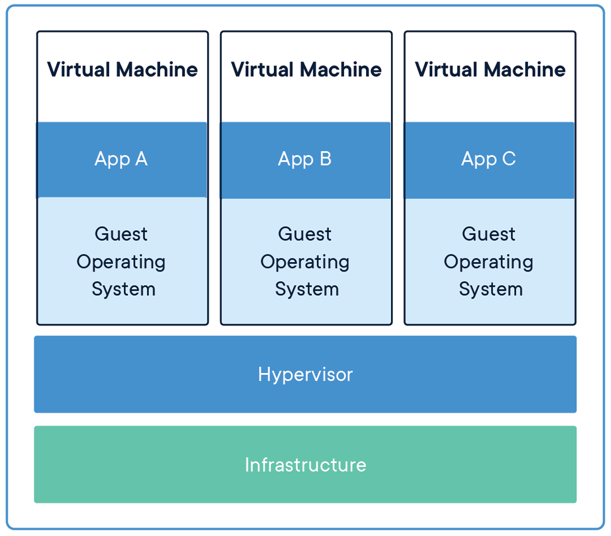
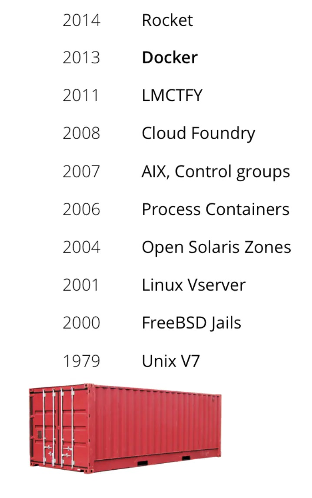
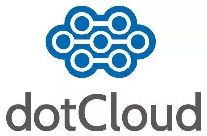
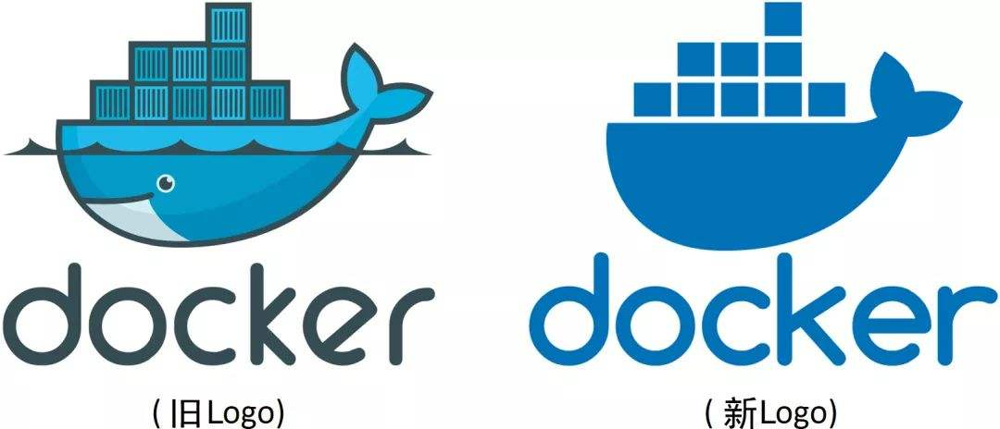
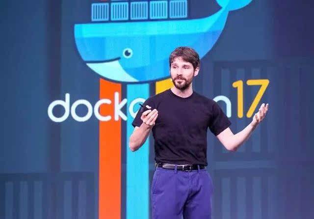
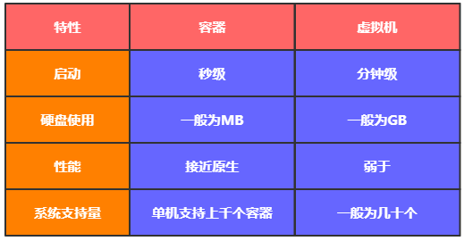

## 虚拟化

　　

　　**要解释清楚 Docker，首先要解释清楚容器（Container）的概念。**要解释容器的话，就需要从操作系统说起。操作系统太底层，细说的话一两本书都说不清楚。这里就一句话来总结一下：操作系统（Operating System，简称OS）是管理计算机硬件与软件资源的计算机程序，并且为软件运行提供通用服务的系统软件。

　　随着硬件的性能提升，软件种类的丰富，有两种情况变得很常见：

1. 硬件性能过剩——很多计算机的硬件配置，往往会有大量时间处于硬件资源闲置的状态。例如一般家用电脑，已经是四核、六核的配置了，除了3A游戏、视频制作、3D渲染、高性能计算等特殊应用外，通常有 90% 以上时间 CPU 是闲置的；
2. 软件冲突——因为业务需要，两个或者多个软件之间冲突，或者需要同一个软件的不同版本。例如早几年做 Web 前端的，要测试网页在不同版本的 IE 上是否能正常显示，然而 Windows 只能装一个版本的 IE。

　　

　　为了解决软件冲突，只能配置多台计算机，或者很麻烦的在同一台电脑上安装多个操作系统。显然这两个方案都有其缺点：多台计算机成本太高，多操作系统的安装、切换都很麻烦。在硬件性能过剩的时候，**硬件虚拟化**的普及就很自然而然的提出来了。

　　所谓硬件虚拟化，就是某个特殊的软件，仿真出一台或者多台计算机的各种硬件，用户可以在这一台虚拟机上安装、运行操作系统（一般叫来宾操作系统，Guest OS）和各种应用，并且把 Guest OS 和上面应用软件对硬件资源的访问转发到底层的硬件上来实现。

　　对于 Guest OS 和上面的应用程序来说，这台虚拟机和普通物理计算机是完全一样没有任何区别的——除了性能可能差一点。全球第一人气的 VMware Workstation 就是这么一个软件，Oracle 的 VirtualBox 以及 Microsoft 的 Virtual PC 都是。这类软件英语有一个专用的单词是 Hypervisor（虚拟机管理程序）。

　　

　　

### 虚拟机的优点

　　

　　可以把资源分配到不同的虚拟机，达到硬件资源的最大化利用；

　　相比直接在物理机上部署应用，虚拟机更容易扩展应用；

　　云服务：通过虚拟机虚拟出不同的物理资源，可以快速搭建云服务。

> 虚拟化技术主要用来解决高性能的物理硬件产能过剩和老旧的硬件产品产能过低的重组重用，透明化底层物理硬件，从而最大化的利用物理硬件。

　　

### 虚拟机的缺点

　　

　　虚拟机的缺点在于 Guest OS 通常会占用不少硬件资源。例如 Windows 安装 VMware 并开机 Guest OS，不运行任何应用的情况下，就需要占用 2 ~ 3G 内存，20 ~ 30G 硬盘空间。而且为了应用系统运行的性能，往往还要给每台虚拟机留出更多的内存容量。虽然不少 Hypervisor 支持动态内存，但基本上都会降低虚拟机的性能。在这样的资源占用情况下，少量的虚拟机还是可以接受的，如果同时运行十多台或数十台虚拟机，硬件资源的浪费就会成倍递增。通常来说，其中相当大一部分甚至全部 Guest OS 都是相同的。

　　能不能所有应用使用同一个操作系统减少硬件资源的浪费，但是又能避免包括运行库在内的软件冲突呢？**操作系统层虚拟化——容器**概念的提出，就是为了解决这个问题。Docker 就是一个容器的标准化实现。

　　

## 容器化

　　

　　容器技术已经发展了很长一段时间了，例如：LXC，BSD Jails，Solaris Zones...

　　容器化就是应用程序级别的虚拟化技术。容器提供了将应用程序的代码、运行时、系统工具、系统库和配置打包到一个实例中的标准方法。容器共享一个内核（操作系统），它安装在硬件上。

　　

　　

　　和虚拟机相比，容器有以下优点：

1. 启动迅速：没有虚拟机硬件的初始化，没有 Guest OS 的启动过程，可以节约很多启动时间，这就是容器的“开箱即用”；
2. 占用资源少：没有运行 Guest OS 所需的内存开销，无需为虚拟机预留运行内存，无需安装、运行 App 不需要的运行库/操作系统服务，内存占用、存储空间占用都小的多。相同配置的服务器，如果运行虚拟机能运行十多台的，通常可以运行上百个容器毫无压力——当然前提是单个容器应用本身不会消耗太多资源。

　　

## Docker 历史

　　

　　2010 年，几个搞 IT 的年轻人，在美国旧金山成立了一家名叫 `dotCloud` 的公司。dotCloud 的平台即服务（Platform-as-a-Service, PaaS）提供商。底层技术上，dotCloud 平台利用了 Linux 的 LXC 容器技术。

　　

　　

　　为了方便创建和管理这些容器，dotCloud 基于 Google 公司推出的 Go 语言开发了一套内部工具，之后被命名为 `Docker`。Docker 就是这样诞生的。

> 　　LXC 是 Docker 的底层基石，但是在 Docker 0.9 版本的时候，Docker 见异思迁了，引入了基于 Go 语言构建的 Libcontainer 的 execution driver。有了 Libcontainer 这个项目，Docker 不再需要依赖于 Linux 部件（LXC，libvirt，systemd-nspawn...）就可以处理 namespaces、control groups、capabilities、apparmor profiles、network interfaces。这下，LXC 沦为可选项。
>
> 
>
> 　　在 Docker 1.8 中 LXC 被 deprecated，在 Docker 1.10，LXC 彻底出局。Docker 推出 Libcontainer 自己集成了 Linux 内核中的很多特性，作为一个独特、稳定且不受制于 Linux 的 Library，独立的时代终于到来了。

　　

　　

　　如同 Docker 的 Logo 一样，Docker 的思想来源于集装箱。集装箱解决了什么问题？在一艘大船上，可以把货物规整的摆放起来，并且各种各样的货物被集装箱标准化，集装箱与集装箱之间互不影响。那么就不需要专门运送水果的船和专门运送化学用品的船了。只要这些货物封装在不同的集装箱里，就可以用一艘大船把它们都运走。

　　Docker 技术诞生之后，并没有引起行业的关注。而 dotCloud 公司，作为一家小型创业企业，在激烈的竞争之下，也步履维艰。

　　正当他们快要坚持不下去的时候，脑子里蹦出了“开源”的想法。什么是“开源”？开源，就是开放源代码。也就是将原来内部保密的程序源代码开放给所有人，然后让大家一起参与进来，贡献代码和意见。

　　有的软件一开始就是开源的。也有的软件，是混不下去，创造者又不想放弃，所以选择开源。自己养不活，就吃“百家饭”嘛。2013 年 3 月，dotCloud 公司的创始人之一，Docker 之父，28 岁的 **Solomon Hykes** 正式决定，将 Docker 项目开源。

　　

　　

　　不开则已，一开惊人。越来越多的 IT 工程师发现了 Docker 的优点，然后蜂拥而至，加入 Docker 开源社区。Docker 的人气迅速攀升，速度之快，令人瞠目结舌。

　　开源当月， Docker 0.1 版本发布。此后的每一个月， Docker 都会发布一个版本。到 2014 年 6 月 9 日， Docker 1.0 版本正式发布。

　　此时的 Docker，已经成为行业里人气最火爆的开源技术，没有之一。甚至像 Google、微软、Amazon、 VMware 这样的巨头们都对它青睐有加，表示将全力支持。

　　Docker 火了之后， dotCloud 公司干脆把公司名字也改成了 Docker Inc. 。

　　

## 为什么选择 Docker

　　

**更高效的利用系统资源**

　　

　　由于容器不需要进行硬件虚拟以及运行完整操作系统等额外开销，Docker 对系统资源的利用率更高。无论是应用执行速度、内存损耗或者文件存储速度，都要比传统虚拟机技术更高效。因此，相比虚拟机技术，一个相同配置的主机，往往可以运行更多数量的应用。

　　

**更快速的启动时间**

　　

　　传统的虚拟机技术启动应用服务往往需要数分钟，而 ==Docker 容器应用，由于直接运行于宿主内核，无需启动完整的操作系统==，因此可以做到秒级、甚至毫秒级的启动时间。大大的节约了开发、测试、部署的时间。

　　

**一致的运行环境**

　　

　　开发过程中一个常见的问题是环境一致性问题。由于开发环境、测试环境、生产环境不一致，导致有些 bug 并未在开发过程中被发现。而 Docker 的镜像提供了除内核外完整的运行时环境，确保了应用运行环境一致性，从而不会再出现「这段代码在我机器上没问题啊」 这类问题。

　　

**持续交付和部署**

　　

　　对开发和运维（DevOps）人员来说，最希望的就是一次创建或配置，可以在任意地方正常运行。

　　使用 Docker 可以通过定制应用镜像来实现持续集成、持续交付、部署。==开发人员可以通过 Dockerfile 来进行镜像构建，并结合持续集成（Continuous Integration）系统进行集成测试==，而运维人员则可以直接在生产环境中快速部署该镜像，甚至结合持续部署（Continuous Delivery/Deployment）系统进行自动部署。

　　而且使用 Dockerfile 使镜像构建透明化，不仅仅开发团队可以理解应用运行环境，也方便运维团队理解应用运行所需条件，帮助更好的在生产环境中部署该镜像。

　　

**更轻松的迁移**

　　

　　由于 Docker 确保了执行环境的一致性，使得应用的迁移更加容易。Docker 可以在很多平台上运行，无论是物理机、虚拟机、公有云、私有云，甚至是笔记本，其运行结果是一致的。因此用户可以很轻易的将在一个平台上运行的应用，迁移到另一个平台上，而不用担心运行环境的变化导致应用无法正常运行的情况。

　　

**更轻松的维护和扩展**

　　

　　Docker 使用的分层存储以及镜像的技术，使得应用重复部分的复用更为容易，也使得应用的维护更新更加简单，基于基础镜像进一步扩展镜像也变得非常简单。此外，Docker 团队同各个开源项目团队一起维护了一大批高质量的 官方镜像，既可以直接在生产环境使用，又可以作为基础进一步定制，大大的降低了应用服务的镜像制作成本。

　　

## 容器与虚拟机的比较

　　

　　下面的图片比较了 Docker 和传统虚拟化方式的不同之处，可见容器是在操作系统层面上实现虚拟化，直接复用本地主机的操作系统，而传统方式则是在硬件层面实现。

　　

　　

　　与传统的虚拟机相比，Docker 优势体现为启动速度快、占用体积小。

