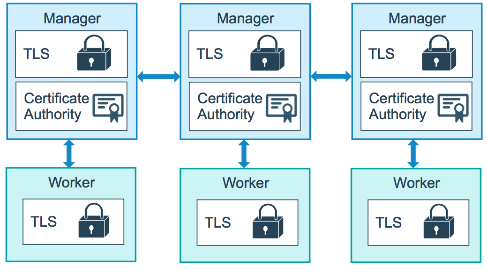
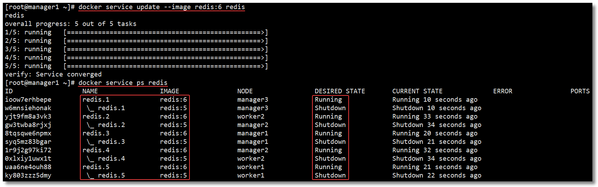
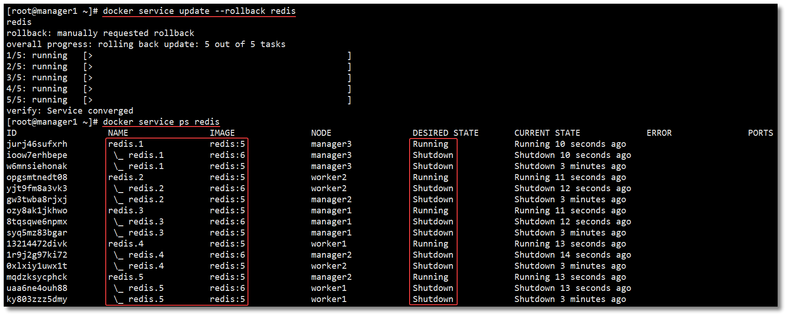

　　上一篇文章《Docker Swarm 集群管理利器核心概念扫盲》中我们把 Swarm 重要的概念性知识给大家讲解了一波，理论完事就该实战了，这篇文章带大家从零开始，搭建 Docker Swarm 集群环境，并通过 Swarm 实现服务的弹性部署，滚动更新服务及回滚服务等功能。

　　

## 集群搭建

　　

### 环境准备

　　


- 五台安装了 Docker 的 CentOS 机器，版本为：`CentOS 7.8.2003`
- Docker Engine 1.12+（最低要求 1.12，本文使用 19.03.12）
- 防火墙开启以下端口或者关闭防火墙：
  - TCP 端口 2377，用于集群管理通信；
  - TCP 和 UDP 端口 7946，用于节点之间通信；
  - UDP 端口 4789，用于覆盖网络。

　　

### 机器分布

　　

| 角色    | IP             | HOSTNAME | Docker 版本 |
| ------- | -------------- | -------- | ----------- |
| Manager | 192.168.10.101 | manager1 | 19.03.12    |
| Manager | 192.168.10.102 | manager2 | 19.03.12    |
| Manager | 192.168.10.103 | manager3 | 19.03.12    |
| Worker  | 192.168.10.10  | worker1  | 19.03.12    |
| Worker  | 192.168.10.11  | worker2  | 19.03.12    |

- 可以通过 `hostname 主机名` 修改机器的主机名（立即生效，重启后失效）；
- 或者 `hostnamectl set-hostname 主机名` 修改机器的主机名（立即生效，重启也生效）；
- 或者 `vi /etc/hosts` 编辑 hosts 文件，如下所示， 给 127.0.0.1 添加主机名（重启生效）。

```hosts
127.0.0.1   localhost localhost.localdomain localhost4 localhost4.localdomain4 manager1
::1         localhost localhost.localdomain localhost6 localhost6.localdomain6
```

　　

### 创建集群

　　

　　在任意节点下通过 `docker swarm init` 命令创建一个新的 Swarm 集群并加入，且该节点会默认成为 Manager 节点。根据我们预先定义的角色，在 101 ~ 103 的任意一台机器上运行该命令即可。

　　通常，第一个加入集群的管理节点将成为 `Leader`，后来加入的管理节点都是 `Reachable`。当前的 Leader 如果挂掉，所有的 Reachable 将重新选举一个新的 Leader。

```shell
[root@localhost ~]# docker swarm init --advertise-addr 192.168.10.101
Swarm initialized: current node (clumstpieg0qzzxt1caeazg8g) is now a manager.

To add a worker to this swarm, run the following command:

    docker swarm join --token SWMTKN-1-5ob7jlej85qsygxubqypjuftiwruvew8e2cr4u3iuo4thxyrhg-3hbf2u3i1iagurdprl3n3yra1 192.168.10.101:2377

To add a manager to this swarm, run 'docker swarm join-token manager' and follow the instructions.
```


　　

### 加入集群

　　

　　Docker 中内置的集群模式自带了公钥基础设施(PKI)系统，使得安全部署容器变得简单。集群中的节点使用传输层安全协议(TLS)对集群中其他节点的通信进行身份验证、授权和加密。

　　默认情况下，通过 `docker swarm init` 命令创建一个新的 Swarm 集群时，Manager 节点会生成新的根证书颁发机构（CA）和密钥对，用于保护与加入群集的其他节点之间的通信安全。

　　Manager 节点会生成两个令牌，供其他节点加入集群时使用：一个 Worker 令牌，一个 Manager 令牌。每个令牌都包括根 CA 证书的摘要和随机生成的密钥。当节点加入群集时，加入的节点使用摘要来验证来自远程管理节点的根 CA 证书。远程管理节点使用密钥来确保加入的节点是批准的节点。

　　



　　

#### Manager

　　

　　若要向该集群添加 Manager 节点，管理节点先运行 `docker swarm join-token manager` 命令查看管理节点的令牌信息。

```shell
docker swarm join-token manager
```


　　

　　然后在其他节点上运行 `docker swarm join` 并携带令牌参数加入 Swarm 集群，该节点角色为 Manager。


　　

#### Worker

　　

　　通过创建集群时返回的结果可以得知，要向这个集群添加一个 Worker 节点，运行下图中的命令即可。或者管理节点先运行 `docker swarm join-token worker` 命令查看工作节点的令牌信息。


　　

　　然后在其他节点上运行 `docker swarm join` 并携带令牌参数加入 Swarm 集群，该节点角色为 Worker。


　　

### 查看集群信息

　　

　　在任意 Manager 节点中运行 `docker info` 可以查看当前集群的信息。


　　

### 查看集群节点

　　

　　在任意 Manager 节点中运行 `docker node ls` 可以查看当前集群节点信息。

```shell
docker node ls
```


> `*` 代表当前节点，现在的环境为 3 个管理节点构成 1 主 2 从，以及 2 个工作节点。

　　

　　节点 `MANAGER STATUS` 说明：表示节点是属于 Manager 还是 Worker，没有值则属于 Worker 节点。

- `Leader`：该节点是管理节点中的主节点，负责该集群的集群管理和编排决策；
- `Reachable`：该节点是管理节点中的从节点，如果 Leader 节点不可用，该节点有资格被选为新的 Leader；
- `Unavailable`：该管理节点已不能与其他管理节点通信。如果管理节点不可用，应该将新的管理节点加入群集，或者将工作节点升级为管理节点。

　　

　　节点 `AVAILABILITY` 说明：表示调度程序是否可以将任务分配给该节点。

- `Active`：调度程序可以将任务分配给该节点；
- `Pause`：调度程序不会将新任务分配给该节点，但现有任务仍可以运行；
- `Drain`：调度程序不会将新任务分配给该节点，并且会关闭该节点所有现有任务，并将它们调度在可用的节点上。

　　

### 删除节点

　　

#### Manager

　　

　　删除节点之前需要先将该节点的 `AVAILABILITY` 改为 `Drain`。其目的是为了将该节点的服务迁移到其他可用节点上，确保服务正常。最好检查一下容器迁移情况，确保这一步已经处理完成再继续往下。

```shell
docker node update --availability drain 节点名称|节点ID
```

　　

　　然后，将该 Manager 节点进行降级处理，降级为 Worker 节点。

```shell
docker node demote 节点名称|节点ID
```

　　

　　然后，在已经降级为 Worker 的节点中运行以下命令，离开集群。

```shell
docker swarm leave
```

　　

　　最后，在管理节点中对刚才离开的节点进行删除。

```shell
docker node rm 节点名称|节点ID
```

　　

#### Worker

　　

　　删除节点之前需要先将该节点的 `AVAILABILITY` 改为 `Drain`。其目的是为了将该节点的服务迁移到其他可用节点上，确保服务正常。最好检查一下容器迁移情况，确保这一步已经处理完成再继续往下。

```shell
docker node update --availability drain 节点名称|节点ID

```

　　

　　然后，在准备删除的 Worker 节点中运行以下命令，离开集群。

```shell
docker swarm leave

```

　　

　　最后，在管理节点中对刚才离开的节点进行删除。

```shell
docker node rm 节点名称|节点ID

```

　　

## 服务部署

　　

> 注意：跟集群管理有关的任何操作，都是在 Manager 节点上操作的。

　　

### 创建服务

　　

　　下面这个案例，使用 nginx 镜像创建了一个名为 mynginx 的服务，该服务会被随机指派给一个工作节点运行。

```shell
docker service create --replicas 1 --name mynginx -p 80:80 nginx

```


- `docker service create`：创建服务；
- `--replicas`：指定一个服务有几个实例运行；
- `--name`：服务名称。

　　

### 查看服务

　　

　　可以通过 `docker service ls` 查看运行的服务。

```shell
[root@manager1 ~]# docker service ls
ID                NAME           MODE              REPLICAS        IMAGE              PORTS
hepx06k5ik5n      mynginx        replicated        1/1             nginx:latest       *:80->80/tcp

```

　　

　　可以通过 `docker service inspect 服务名称|服务ID` 查看服务的详细信息。

```shell
[root@manager1 ~]# docker service inspect mynginx
[
    {
        "ID": "k0dbjg1zzy3l3g71kdwa56ect",
        "Version": {
            "Index": 127
        },
        "CreatedAt": "2020-09-16T10:05:55.627974095Z",
        "UpdatedAt": "2020-09-16T10:05:55.629507771Z",
        "Spec": {
            "Name": "mynginx",
            "Labels": {},
            "TaskTemplate": {
                "ContainerSpec": {
                    "Image": "nginx:latest@sha256:c628b67d21744fce822d22fdcc0389f6bd763daac23a6b77147d0712ea7102d0",
                    "Init": false,
                    "StopGracePeriod": 10000000000,
                    "DNSConfig": {},
                    "Isolation": "default"
                },
                "Resources": {
                    "Limits": {},
                    "Reservations": {}
                },
                "RestartPolicy": {
                    "Condition": "any",
                    "Delay": 5000000000,
                    "MaxAttempts": 0
                },
                "Placement": {
                    "Platforms": [
                        {
                            "Architecture": "amd64",
                            "OS": "linux"
                        },
                        {
                            "OS": "linux"
                        },
                        {
                            "OS": "linux"
                        },
                        {
                            "Architecture": "arm64",
                            "OS": "linux"
                        },
                        {
                            "Architecture": "386",
                            "OS": "linux"
                        },
                        {
                            "Architecture": "mips64le",
                            "OS": "linux"
                        },
                        {
                            "Architecture": "ppc64le",
                            "OS": "linux"
                        },
                        {
                            "Architecture": "s390x",
                            "OS": "linux"
                        }
                    ]
                },
                "ForceUpdate": 0,
                "Runtime": "container"
            },
            "Mode": {
                "Replicated": {
                    "Replicas": 1
                }
            },
            "UpdateConfig": {
                "Parallelism": 1,
                "FailureAction": "pause",
                "Monitor": 5000000000,
                "MaxFailureRatio": 0,
                "Order": "stop-first"
            },
            "RollbackConfig": {
                "Parallelism": 1,
                "FailureAction": "pause",
                "Monitor": 5000000000,
                "MaxFailureRatio": 0,
                "Order": "stop-first"
            },
            "EndpointSpec": {
                "Mode": "vip",
                "Ports": [
                    {
                        "Protocol": "tcp",
                        "TargetPort": 80,
                        "PublishedPort": 80,
                        "PublishMode": "ingress"
                    }
                ]
            }
        },
        "Endpoint": {
            "Spec": {
                "Mode": "vip",
                "Ports": [
                    {
                        "Protocol": "tcp",
                        "TargetPort": 80,
                        "PublishedPort": 80,
                        "PublishMode": "ingress"
                    }
                ]
            },
            "Ports": [
                {
                    "Protocol": "tcp",
                    "TargetPort": 80,
                    "PublishedPort": 80,
                    "PublishMode": "ingress"
                }
            ],
            "VirtualIPs": [
                {
                    "NetworkID": "st2xiy7pjzap093wz4w4u6nbs",
                    "Addr": "10.0.0.15/24"
                }
            ]
        }
    }
]

```

　　

　　可以通过 `docker service ps 服务名称|服务ID` 查看服务运行在哪些节点上。


　　在对应的任务节点上运行 `docker ps` 可以查看该服务对应容器的相关信息。


　　

### 调用服务

　　

　　接下来我们测试一下服务是否能被正常访问，并且该集群下任意节点的 IP 地址都要能访问到该服务才行。

　　测试结果：5 台机器均可正常访问到该服务。


　　

### 弹性服务

　　

　　将 service 部署到集群以后，可以通过命令弹性扩缩容 service 中的容器数量。在 service 中运行的容器被称为 task（任务）。

　　通过 `docker service scale 服务名称|服务ID=n` 可以将 service 运行的任务扩缩容为 n 个。

　　通过 `docker service update --replicas n 服务名称|服务ID` 也可以达到扩缩容的效果。

　　将 mynginx service 运行的任务扩展为 5 个：

```shell
[root@manager1 ~]# docker service scale mynginx=5
mynginx scaled to 5
overall progress: 5 out of 5 tasks 
1/5: running   [==================================================>] 
2/5: running   [==================================================>] 
3/5: running   [==================================================>] 
4/5: running   [==================================================>] 
5/5: running   [==================================================>] 
verify: Service converged

```

　　通过 `docker service ps 服务名称|服务ID` 查看服务运行在哪些节点上。


　　

　　我们再来一波缩容的操作，命令如下：

```shell
[root@manager1 ~]# docker service update --replicas 3 mynginx
mynginx
overall progress: 3 out of 3 tasks 
1/3: running   [==================================================>] 
2/3: running   [==================================================>] 
3/3: running   [==================================================>] 
verify: Service converged

```

　　通过 `docker service ps 服务名称|服务ID` 查看服务运行在哪些节点上。


　　在 Swarm 集群模式下真正意义实现了所谓的**弹性服务**，动态扩缩容一行命令搞定，简单、便捷、强大。

　　

### 删除服务

　　

　　通过 `docker service rm 服务名称|服务ID` 即可删除服务。

```shell
[root@manager1 ~]# docker service rm mynginx
mynginx
[root@manager1 ~]# docker service ls
ID                NAME              MODE              REPLICAS          IMAGE             PORTS

```

　　

## 滚动更新及回滚

　　

　　以下案例将演示 Redis 版本如何滚动升级至更高版本再回滚至上一次的操作。

　　首先，创建 5 个 Redis 服务副本，版本为 5，详细命令如下：

```shell
# 创建 5 个副本，每次更新 2 个，更新间隔 10s，20% 任务失败继续执行，超出 20% 执行回滚，每次回滚 2 个
docker service create --replicas 5 --name redis \
--update-delay 10s \
--update-parallelism 2 \
--update-failure-action continue \
--rollback-monitor 20s \
--rollback-parallelism 2 \
--rollback-max-failure-ratio 0.2 \
redis:5

```

- `--update-delay`：定义滚动更新的时间间隔；
- `--update-parallelism`：定义并行更新的副本数量，默认为 1；
- `--update-failure-action`：定义容器启动失败之后所执行的动作；
- `--rollback-monitor`：定义回滚的监控时间；
- `--rollback-parallelism`：定义并行回滚的副本数量；
- `--rollback-max-failure-ratio`：任务失败回滚比率，超过该比率执行回滚操作，0.2 表示 20%。

　　

　　然后通过以下命令实现服务的滚动更新。

```shell
docker service update --image redis:6 redis

```



　　

　　回滚服务，只能回滚到上一次操作的状态，并不能连续回滚到指定操作。

```shell
docker service update --rollback redis

```



　　

## 常用命令

　　

### docker swarm

　　

| 命令                            | 说明                 |
| :------------------------------ | -------------------- |
| docker swarm init               | 初始化集群           |
| docker swarm join-token worker  | 查看工作节点的 token |
| docker swarm join-token manager | 查看管理节点的 token |
| docker swarm join               | 加入集群             |

　　

### docker node

　　

| 命令                                 | 说明                               |
| ------------------------------------ | ---------------------------------- |
| docker node ls                       | 查看集群所有节点                   |
| docker node ps                       | 查看当前节点所有任务               |
| docker node rm 节点名称\|节点ID      | 删除节点（`-f`强制删除）           |
| docker node inspect 节点名称\|节点ID | 查看节点详情                       |
| docker node demote 节点名称\|节点ID  | 节点降级，由管理节点降级为工作节点 |
| docker node promote 节点名称\|节点ID | 节点升级，由工作节点升级为管理节点 |
| docker node update 节点名称\|节点ID  | 更新节点                           |

　　

### docker service

　　

| 命令                                    | 说明                     |
| --------------------------------------- | ------------------------ |
| docker service create                   | 创建服务                 |
| docker service ls                       | 查看所有服务             |
| docker service inspect 服务名称\|服务ID | 查看服务详情             |
| docker service logs 服务名称\|服务ID    | 查看服务日志             |
| docker service rm 服务名称\|服务ID      | 删除服务（`-f`强制删除） |
| docker service scale 服务名称\|服务ID=n | 设置服务数量             |
| docker service update 服务名称\|服务ID  | 更新服务                 |

　　

## 参考资料

　　

- https://docs.docker.com/engine/swarm/swarm-tutorial/
- https://docs.docker.com/engine/swarm/swarm-mode/
- https://docs.docker.com/engine/swarm/how-swarm-mode-works/pki/
- https://docs.docker.com/engine/swarm/join-nodes/
- https://docs.docker.com/engine/swarm/swarm-tutorial/rolling-update/

